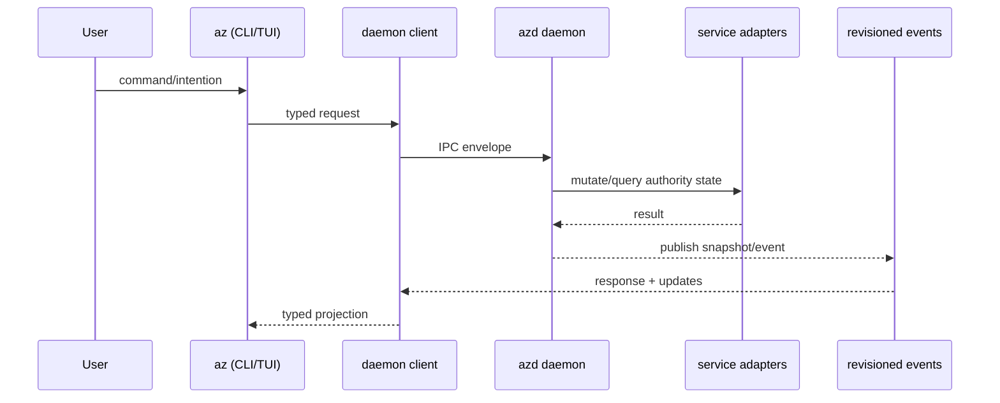
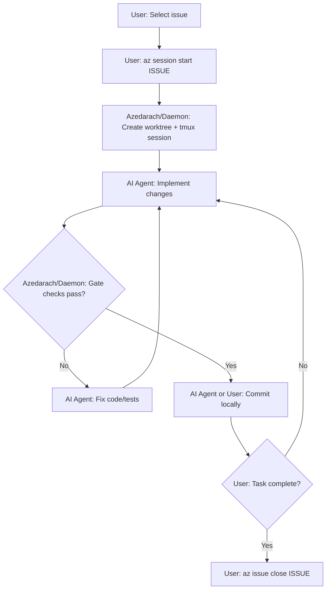
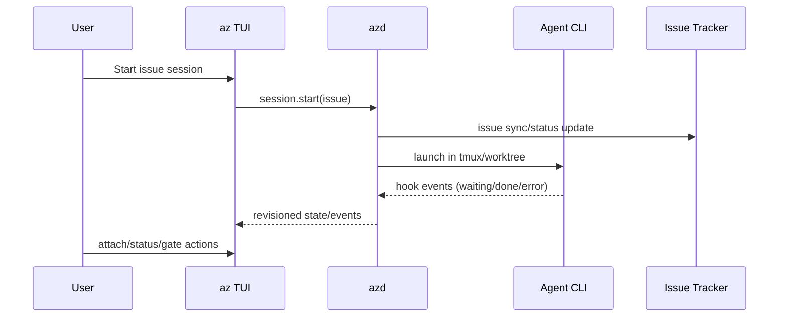
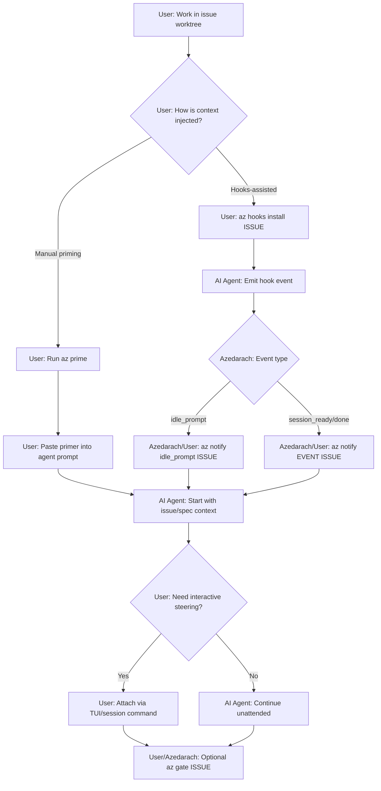

# Azedarach

Terminal Kanban orchestration for parallel AI coding sessions, implemented in Go with Bubbletea.

## Overview

Azedarach is a terminal board and CLI for issue-driven development across parallel git worktrees.

It combines:
- A Bubbletea TUI (`az`) for daily workflow
- A daemon runtime (`azd`) for state authority and coordination
- Issue tracker commands (`az issue ...`)
- Agent session orchestration (`az session ...`, hooks, gate/dev flows)
- Project and operation management for multi-repo workflows

## Current Implementation

This repository ships the Go implementation as the canonical runtime:
- CLI: `cmd/az`
- Daemon: `cmd/azd`
- Core docs: `docs/`

## Quick Start

Build, link, and run:

```bash
just build-link-run
```

Build and link without starting interactive TUI:

```bash
just build-link-run -- --no-run
```

Then verify:

```bash
az --help
azd --help
```

## Feature Areas

### CLI + TUI

- Start interactive board: `az`
- Session lifecycle commands: `az session start|attach|kill|status`
- Project registry commands: `az project list|add|remove|switch`
- Snapshot and support commands: `az export`, `az sync`, `az prime`

### Agent Session Orchestration

- Starts work in isolated git worktrees tied to issues
- Supports attach/detach flow for active sessions
- Handles hook notifications: `az notify <event> <issue-id>`
- Installs hook configuration: `az hooks install <issue-id>`
- Runs quality gates: `az gate <issue-id>` and `az dev gate <issue-id>`
- Manages per-issue dev servers: `az dev start|stop|restart|status` and `az dev list`

### Issue Tracker Workflows

- CRUD and query: `az issue list|get|get-many|create|update|close|delete`
- Dependency graph operations: `az issue dep add|remove|bulk apply`
- Bulk planning flows: `az issue bulk-create`, `az issue bulk-update`
- Fanout workflow support: `az issue fanout`, `az issue fanout ready`, `az issue fanout drift`
- Integrity checks: `az issue doctor`

### Spec + Policy Integration

- Project-level spec gate toggle:
  - `az config set spec.enabled true`
  - `az config set spec.enabled false`
- Use spec-synced Markdown under `docs/spec/` as the spec documentation source of truth.
- Keep implementation/planning docs in `docs/` aligned to those spec-synced files.
- Pre-commit runs spec sync (when configured) and auto-stages `docs/spec/` updates.

### Daemon + Operations

- Daemon lifecycle recovery: `az daemon restart`
- Background operation control: `az operation list|get|cancel`
- Mailbox event flow for orchestrator/worker coordination: `az mail send|list|watch`

## Architecture


Runtime flow:



Authority model:
- `az`/TUI builds intents and renders projection state.
- `azd` owns lifecycle mutations (sessions/worktrees/devservers) and publishes revisioned updates.
- Cross-process payloads are typed contracts, not UI message types.

## Flow Diagrams

### User Flow: PR-Based Delivery


### User Flow: Local-Only Delivery



### Agent Flow: TUI-Managed Session



### Agent Flow: `az prime` (Manual or Hooks-Assisted)



## Development Commands

This list is intentionally non-exhaustive. Run `just --list` for all available tasks.

```bash
just build         # build bin/az + bin/azd
just run           # restart daemon + run az
just test          # go test -v ./...
just type-check    # go build ./...
just check-boundaries
just spec-sync     # run spec sync hook logic and auto-stage docs/spec when configured
```

Spec sync hook configuration:

```bash
# Optional: configure the exact command used by pre-commit for this shell/session.
# Replace with your actual spec sync command.
export AZ_SPEC_SYNC_CMD='spec sync --to-md docs/spec'
```

Direct Go entrypoint examples:

```bash
go run ./cmd/az
go run ./cmd/azd
```

## System Requirements

- Go >= 1.21
- Git >= 2.20
- tmux >= 3.0
- GitHub CLI (`gh`) authenticated
- Issue tracker CLI configured (`az issue ...`)

## Documentation

Audience: these are **developer/internal docs** for contributors and maintainers.

- Overview: [docs/01-overview.md](docs/01-overview.md)
- Architecture: [docs/02-architecture.md](docs/02-architecture.md)
- Project structure: [docs/03-project-structure.md](docs/03-project-structure.md)
- Recovery playbook: [docs/08-recovery-playbook.md](docs/08-recovery-playbook.md)
- Release + Homebrew: [docs/10-go-release-and-homebrew.md](docs/10-go-release-and-homebrew.md)
- Full docs index + audience notes: [docs/README.md](docs/README.md)

## Release

Homebrew release flow:

```bash
just release-homebrew -- --patch --tap-dir ../homebrew-azedarach
```
