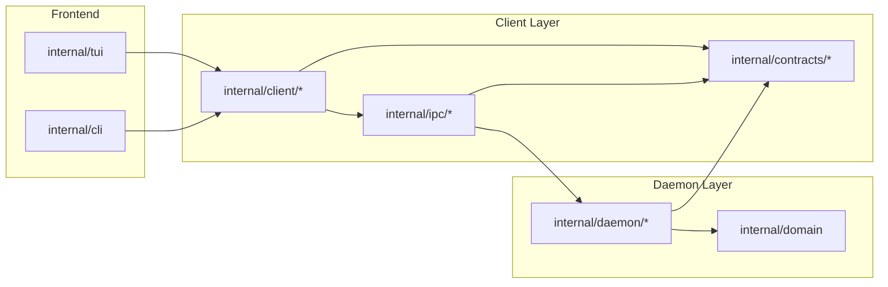
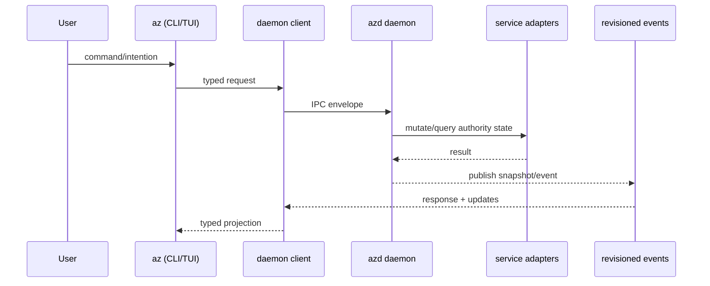
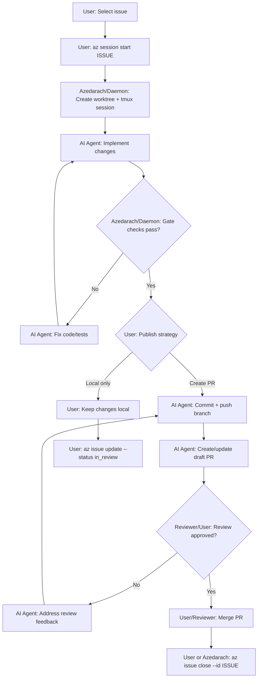
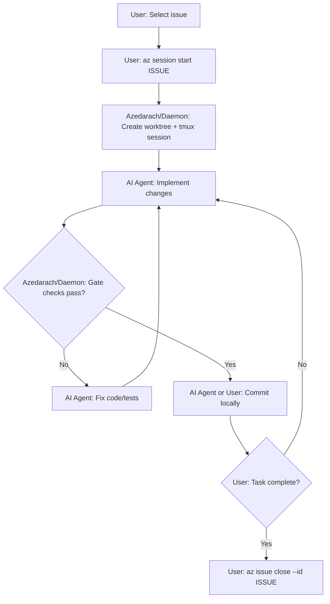
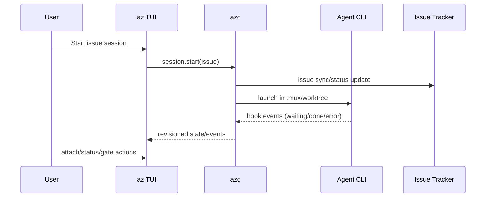
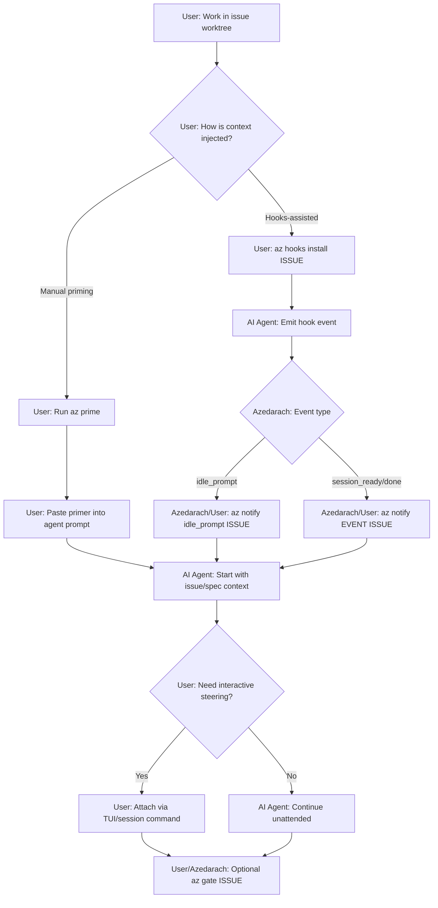

# Azedarach

Terminal Kanban orchestration for parallel AI coding sessions, implemented in Go with Bubbletea.

## Overview

Azedarach is a terminal board and CLI for issue-driven development across parallel git worktrees.

It combines:
- A Bubbletea TUI (`az`) for daily workflow
- A daemon runtime (`azd`) for state authority and coordination
- Issue tracker commands (`az issue ...`)
- Agent session orchestration (`az session ...`, hooks, gate/dev flows)
- Project and operation management for multi-repo workflows

## Current Implementation

This repository ships the Go implementation as the canonical runtime:
- CLI: `cmd/az`
- Daemon: `cmd/azd`
- Core docs: `docs/`

## Quick Start

Build, link, and run:

```bash
just build-link-run
```

This also starts or reuses a local Jaeger container named `azedarach-jaeger`
for OTLP traces. It prefers `localhost:4318` and `http://localhost:16686`,
falls back to available localhost ports when those are occupied, and exports
the discovered OTLP endpoint to the launched daemon and TUI. Set
`AZEDARACH_SKIP_JAEGER=1` to skip that startup step.

Jaeger starts with recoverable local Badger storage by default
(`AZEDARACH_JAEGER_STORAGE=badger`) on the named volume
`azedarach-jaeger-data`, with a container memory limit
(`AZEDARACH_JAEGER_MEMORY=1g`) and a retention TTL
(`AZEDARACH_JAEGER_BADGER_TTL=72h`). Set `AZEDARACH_JAEGER_VOLUME` to choose a
different volume, `AZEDARACH_JAEGER_MEMORY=none` to disable the container memory
limit, or `AZEDARACH_JAEGER_STORAGE=memory` with
`AZEDARACH_JAEGER_MAX_TRACES=20000` for throwaway in-memory traces. If the
existing `azedarach-jaeger` container was OOM-killed or was created with older
storage settings, `just build-link-run` recreates it with the current defaults.
Badger retains traces by TTL; it does not guarantee keeping all error traces
after expiry.

Build and link without starting interactive TUI:

```bash
just build-link-run -- --no-run
```

Then verify:

```bash
az --help
azd --help
```

## Feature Areas

### CLI + TUI

- Start interactive board: `az`
- Session lifecycle commands: `az session start|attach|stop|status`
- Deprecated session stop aliases remain available: `az session kill`, `az kill`
- Project registry commands: `az project list|add|remove|switch`
- Snapshot and support commands: `az export`, `az sync`, `az prime`

### Agent Session Orchestration

- Starts work in isolated git worktrees tied to issues
- Supports attach/detach flow for active sessions
- Handles hook notifications: `az notify <event> <issue-id>`
- Installs hook configuration: `az hooks install <issue-id>`
- Runs quality gates: `az gate <issue-id>` and `az dev gate <issue-id>`
- Manages per-issue dev servers: `az dev start|stop|restart|status` and `az dev list`

### AI Account Profiles

- Save the current provider credentials: `az ai account backup <provider> <profile>`
- Inspect saved and active profiles: `az ai account list` and `az ai account status`
- Switch credentials atomically: `az ai account activate <provider> <profile>`
- Switch Codex credentials and gracefully reload attributable persistent servers:
  `az ai account activate --reload-daemon codex <profile>`
- Remove a saved profile: `az ai account delete --confirm <provider> <profile>`
- Supported providers are `claude` and `codex`; commands accept `--json` for agent use.
- Credentials remain in a permission-restricted user-local vault under
  `~/.local/share/azedarach/accounts/`. Profile output never includes credential
  contents. Treat vault files as bearer secrets and keep them out of backups,
  repositories, and support bundles unless those systems are encrypted.
- Activation applies immediately to new provider processes. Codex activation
  detects persistent `app-server`/`mcp-server` processes; `--reload-daemon`
  sends `SIGTERM` only when the process environment positively matches the
  configured `CODEX_HOME`. Unattributable or differently scoped processes are
  left running. Existing Claude and interactive Codex sessions still require
  `az session restart-all` or a manual restart.
- Projects can opt into Codex's native client/server runtime with
  `session.codexAppServer: true`. Azedarach ensures the managed app-server is
  running, launches the stock TUI with `--remote unix://`, and supervises an
  exact-worktree `resume --last` when a daemon restart disconnects the thin
  client. Account activation prefers Codex's official scoped
  `app-server daemon restart`; PID scanning remains a fallback for standalone
  legacy sessions.
- Claude profiles include the primary credentials, account state, config auth,
  API-key settings, and the field-scoped macOS Desktop OAuth cache when present.
- Before switching, Azedarach preserves unmatched live credentials in protected
  `_original`/rotating safety profiles and re-snapshots a matched outgoing
  profile so provider token refreshes are not lost.
- Codex account commands enforce file-backed credential storage and refuse to
  replace newer live tokens with an older snapshot of the same identity.

### Issue Tracker Workflows

- CRUD and query: `az issue list|get|get-many|create|split|update|close|delete`
- Dependency graph operations: `az issue dep add|remove|bulk apply`
- Bulk planning flows: `az issue bulk-create`, `az issue bulk-update`
- Fanout workflow support: `az issue split` for isolated child worktrees with explicit parent-side merge, plus `az issue fanout`, `az issue fanout ready`, `az issue fanout drift`
- Integrity checks: `az issue doctor`

### Spec + Policy Integration

- Project-level spec gate toggle:
  - `az config set spec.enabled true`
  - `az config set spec.enabled false`
- Use `az spec read --json` for stored requirement/link data.
- Markdown spec export is disabled until it can export the real stored spec data.

### Daemon + Operations

- Daemon lifecycle recovery: `az daemon restart`
- Background operation control: `az operation list|get|cancel`
- Mailbox event flow for orchestrator/worker coordination: `az mail send|list|watch`
- Project stewardship: `az orchestrator-session start|attach|status`, then
  `az orchestrate status|start|watch|complete-check`; omit `--root` for the whole
  project or pass `--root <issue-id>` for rooted scope.
- Human decisions: `az interaction list|get|discuss|answer|resolve|withdraw`.
  Unresolved requests block their issue without blocking unrelated work.

## Architecture



Runtime flow:



Authority model:
- `az`/TUI builds intents and renders projection state.
- `azd` owns lifecycle mutations (sessions/worktrees/devservers) and publishes revisioned updates.
- Cross-process payloads are typed contracts, not UI message types.
- Daemon invariants must explicitly choose a source of truth: `projection`, `tmux`, or `hybrid`.
- Projection-backed invariants are refresh-then-cache: refresh in-memory state from durable SQLite projections first, then evaluate from refreshed cache.
- Runtime-presence invariants (for example session start/attach/stop target checks) use tmux as source of truth.

## Flow Diagrams

### User Flow: PR-Based Delivery



### User Flow: Local-Only Delivery



`az issue close --id ISSUE` finalizes the issue lifecycle: it integrates the issue
branch into the resolved target branch, cleans session/worktree attachments, then
asks the daemon to write the closed status. Close guards block dirty, conflicted,
unmerged, or unresolved child work before cleanup removes the worktree.

### Agent Flow: TUI-Managed Session



### Agent Flow: `az prime` (Manual or Hooks-Assisted)



## Development Commands

This list is intentionally non-exhaustive. Run `just --list` for all available tasks.

```bash
just build         # build isolated .tmp/az-test/az + azd validation binaries
just run           # restart daemon + run az
just test          # go test -v ./...
just type-check    # go build ./...
just check-boundaries
just git-config-lock
just git-config-unlock
just git-config-status
```

Ordinary `build` and `clean` recipes preserve `bin/az` and `bin/azd`. The
explicit `just build-link-run` workflow compiles in `.tmp/az-install` and then
atomically installs standalone `az` and `azd` files into the selected stable
user bin directory (an existing global command directory, Homebrew's bin, or
`~/.local/bin`). The installed commands never link back into a Git worktree,
and linked worktrees are rejected before building.

Direct Go entrypoint examples:

```bash
go run ./cmd/az
go run ./cmd/azd
```

## Git Config Safety Guard

If `git config core.bare true` is accidentally written into `.git/config`, Git treats the repository as bare and normal worktree commands fail.

To prevent accidental flips, lock `.git/config` as immutable:

```bash
just git-config-lock
```

To intentionally edit local git config later:

```bash
just git-config-unlock
# make git config changes
just git-config-lock
```

Check current state anytime:

```bash
just git-config-status
```

## System Requirements

- Go >= 1.21
- Git >= 2.20
- tmux >= 3.0
- GitHub CLI (`gh`) authenticated
- Issue tracker CLI configured (`az issue ...`)

## Documentation

Audience: these are **developer/internal docs** for contributors and maintainers.

- Overview: [docs/01-overview.md](docs/01-overview.md)
- Architecture: [docs/02-architecture.md](docs/02-architecture.md)
- Project structure: [docs/03-project-structure.md](docs/03-project-structure.md)
- Recovery playbook: [docs/08-recovery-playbook.md](docs/08-recovery-playbook.md)
- Release + Homebrew: [docs/10-go-release-and-homebrew.md](docs/10-go-release-and-homebrew.md)
- Full docs index + audience notes: [docs/README.md](docs/README.md)

## Release

Homebrew release flow:

```bash
just release-homebrew -- --patch --tap-dir ../homebrew-azedarach
```
