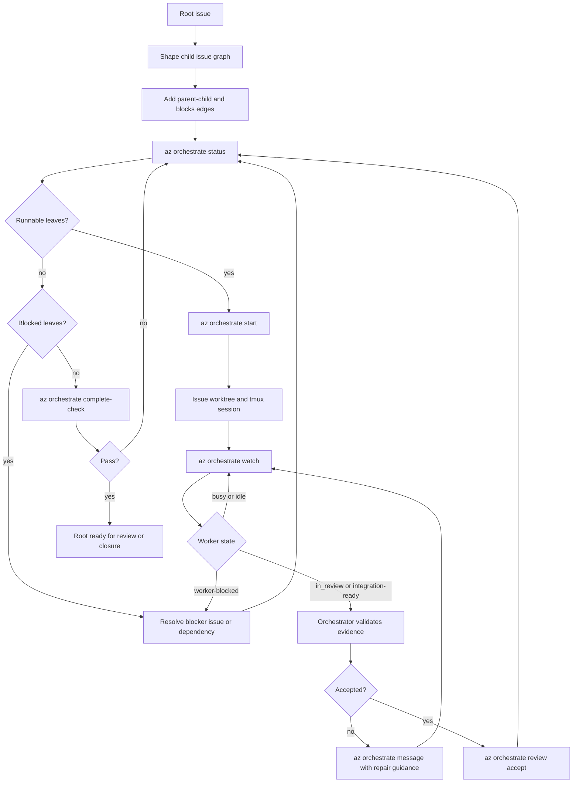
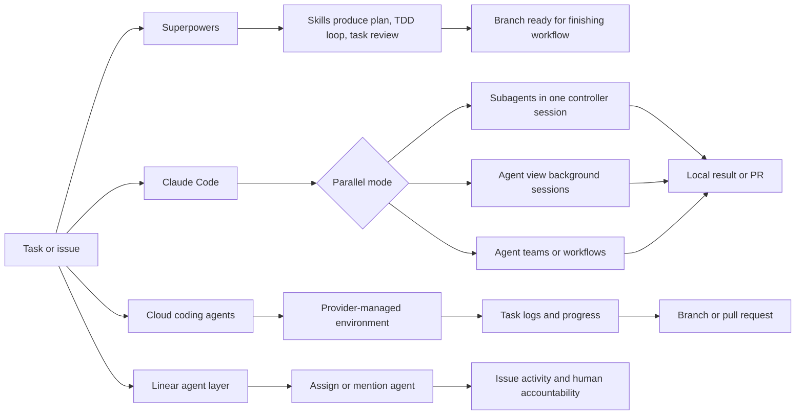
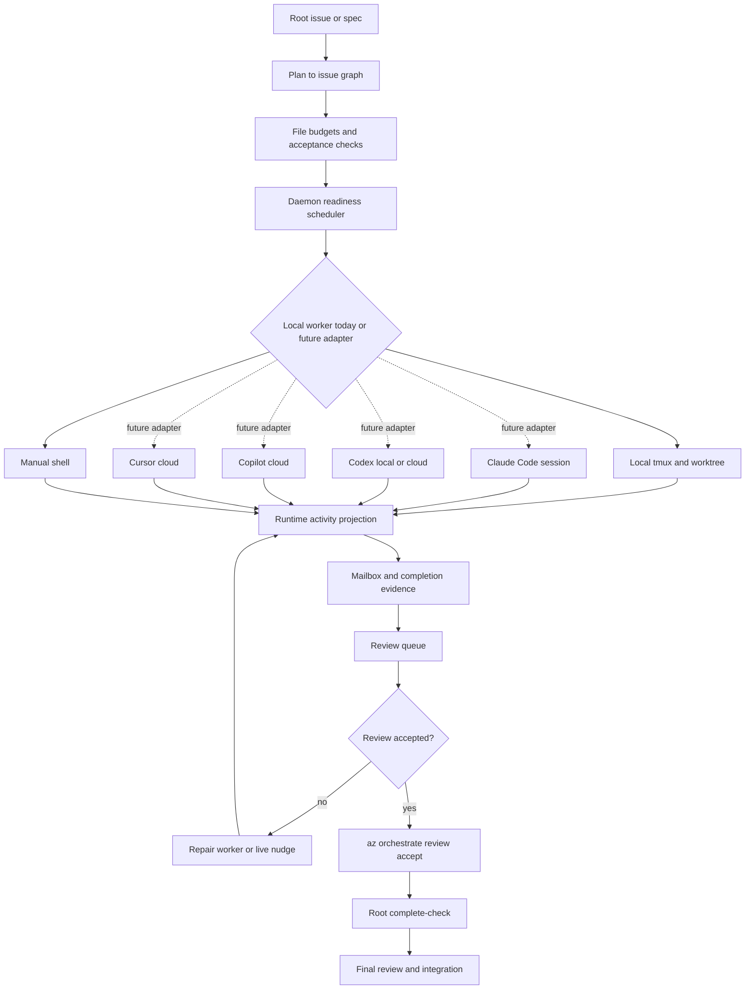

# Orchestration Flow Comparison

Last researched: 2026-06-18

## Scope

This note compares Azedarach's current `az` orchestration flow with current
public workflows from Superpowers and major agent coding systems. It focuses on
how work is split, launched, monitored, reviewed, and integrated. It does not
compare model quality.

Primary local reference points:

- `az prime`
- `az orchestrate status --root <issue-id> --json`
- `az orchestrate start --root <issue-id> --limit <n>`
- `az orchestrate watch --root <issue-id> --since <seq> --jsonl`
- `az orchestrate message --root <issue-id> --issue <worker-issue> --body "..."`
- `az orchestrate integrate --issue <issue-id>`
- `az issue close --id <issue-id>`
- `az orchestrate complete-check --root <issue-id>`
- [docs/06-daemon-battle-tested-path.md](06-daemon-battle-tested-path.md)
- [docs/08-recovery-playbook.md](08-recovery-playbook.md)

## Executive Summary

Az is strongest as a local, durable coordination plane. It treats issue state,
dependency readiness, tmux sessions, worktrees, mailbox events, and integration
gates as one recoverable system owned by the daemon. That is meaningfully
different from cloud coding agents, which optimize for "assign task, get PR",
and from Superpowers, which optimizes for agent discipline through reusable
skills and reviews.

The best industry pattern to copy is not any single product. The target shape is:

- Keep Az's durable issue graph and daemon authority as the source of truth.
- Add a more legible "agent view" for active sessions, waiting states, and
  review readiness.
- Turn planning into first-class graph construction, with explicit file budgets
  and review gates.
- Keep the current local-only runtime model explicit, then consider future
  worker adapters that preserve the same local Az graph and integration
  semantics.
- Improve completion artifacts: task evidence, final review, PR/merge summary,
  and cost/runtime visibility.

## Current Az Flow

Az's orchestration loop is graph-first:

1. Create or split child issues under a root.
2. Add `blocks` edges for ordering and readiness.
3. Check graph readiness with `az orchestrate status`.
4. Start runnable leaf workers with `az orchestrate start`.
5. Watch progress with `az orchestrate watch`.
6. Use mailbox or native session messages for coordination.
7. Treat `in_review` as "ready for orchestrator validation", not blocked.
8. Accept and close reviewed workers through `az orchestrate review accept --root <root> --issue <worker>`.
9. Run `az orchestrate complete-check --root <root>` before finishing.

The key architectural choice is daemon authority. The daemon owns lifecycle and
side effects for sessions, worktrees, dev servers, graph readiness, completion
checks, and integration readiness. CLI and TUI are thin clients. This gives Az
durability and cross-process recovery that many prompt-only workflows lack.

Important Az differentiators:

- Durable issue graph: parent-child and `blocks` edges drive runnable work.
- Local isolation: worker sessions are issue-scoped tmux/worktree resources.
- Explicit activity projection: active sessions report `busy`, `idle`,
  `no-agent`, or `unknown` with source metadata.
- Coordination mailbox: worker progress and integration readiness can be
  persisted independently from terminal scrollback.
- Recovery-oriented commands: `close-session`, `integrate`, and complete-check
  separate inspection, repair, and authoritative close.
- Invariant policy: source-of-truth choices are documented as `projection`,
  `tmux`, or `hybrid`.

## Flow Charts

### Current Az Orchestration Loop



### Peer Orchestration Archetypes



### Recommended Az Target Shape



Az today is local-only: the durable graph, issue state, evidence, and runtime
projection live in project-local SQLite and local filesystem state. The dashed
adapter paths above are future integration directions, not current Az runtime
capabilities.

## Peer Models

### Superpowers

Superpowers is a methodology and skills framework rather than an orchestration
daemon. Its basic workflow emphasizes brainstorm, worktree isolation,
implementation planning, subagent-driven development or plan execution, TDD,
code review, and branch finishing. The subagent-driven workflow uses a fresh
implementer subagent per task, a task-specific review, fix loops for findings,
a final whole-branch review, and a durable progress ledger.

What Az should learn:

- Make planning and review gates more explicit and reusable.
- Require task briefs that are small enough for a fresh worker context.
- Keep a durable progress ledger or equivalent resumability artifact.
- Add a final whole-branch review phase before root completion.

Where Az is already stronger:

- Superpowers depends on the harness correctly dispatching subagents and on the
  controller following skill instructions. Az can encode readiness, start,
  watch, dependency, and close behavior as daemon-backed commands.
- Superpowers is mostly methodology-as-code. Az has a durable issue graph,
  runtime projection, and repair commands.

### Claude Code

Claude Code now has several local parallelism modes: subagents, agent view,
agent teams, dynamic workflows, and worktrees. Its agent view is the closest UX
peer to Az's TUI goal: a terminal screen showing background sessions, what is
working, what needs input, and what is done. Worktrees provide local edit
isolation, and background sessions can be attached later.

What Az should learn:

- Present session state as a first-class agent view, not just a board side
  effect.
- Make "needs input", "working", "ready for review", "completed", and "failed"
  visually obvious.
- Support quick attach, peek, reply, stop, and cleanup from one surface.

Where Az is already stronger:

- Az models dependencies and issue hierarchy directly. Claude's local views are
  session-centric unless paired with another tracker or workflow.
- Az has explicit close/integrate commands tied to issue graph completion.

### OpenAI Codex Cloud

Codex cloud runs tasks in a managed environment, including parallel background
tasks, and can create pull requests from its work. Codex also integrates with
Linear: assigning an issue to Codex or mentioning `@Codex` creates a cloud task,
posts progress/results, and links the finished task so a pull request can be
created.

What Az should learn:

- Treat cloud execution as another worker backend, not a replacement for graph
  orchestration.
- Preserve progress links and final task artifacts in issue notes.
- Add clear environment/repo selection for workers.

Where Az is already stronger:

- Az can coordinate local, inspectable tmux/worktree sessions without requiring
  a managed cloud environment.
- Az dependency readiness is graph-derived and explicit.

### GitHub Copilot Cloud Agent

Copilot cloud agent is issue/PR-centric. It works in a GitHub Actions-powered
ephemeral environment, researches and plans, makes changes on a branch, runs
checks, and can open pull requests. GitHub's docs emphasize transparency through
commits and logs, automation triggers, and GitHub-native collaboration. Its
Linear integration can create a WIP PR from a Linear issue and post completion
activity back to Linear.

What Az should learn:

- Make commits, logs, and review artifacts easy to inspect from the orchestration
  surface.
- Add optional automation triggers for routine issue classes.
- Make PR creation/review a first-class completion path.

Where Az is already stronger:

- Copilot's unit of delegation is generally the issue-to-PR task. Az can express
  multi-step issue graphs with dependency blocking and staged integration.

### Cursor Cloud Agents

Cursor's Linear integration lets teams assign an issue to `@Cursor` or mention
it in comments. Cursor analyzes the issue, starts a background agent, uses issue
details/comments/linked references as context, and notifies when the task opens
a pull request. Cursor also emphasizes picking up agent work inside the editor
for follow-up review or direct edits.

What Az should learn:

- Let humans continue work locally from an agent-produced branch/worktree with a
  smooth handoff.
- Pull linked references and comments into worker prompts automatically.
- Support triage rules for simple recurring categories.

Where Az is already stronger:

- Az already has local worktree/session ownership and can keep the worker
  identity tied to the issue graph.

### Linear Agent Layer

Linear is not primarily a coding agent. Its useful pattern is the agent-aware
work tracker: agents are workspace members, humans remain accountable, agents
can work across multiple issues, and activity/reasoning remains visible.

What Az should learn:

- Keep human accountability explicit when delegating work.
- Represent agent activity as issue activity, not only as session output.
- Support multiple agent providers behind one issue workflow.

Where Az is already stronger:

- Az can own the actual runtime lifecycle rather than only delegating to external
  agents.

### Devin and Jules

Devin and Jules represent the high-autonomy cloud-agent end of the spectrum.
Devin emphasizes complex engineering tasks, review/visual QA, multi-repo
migrations, tool integrations, automations, and teams of agents. Jules is an
asynchronous GitHub-connected coding agent for bugs, docs, and features that
works autonomously after repository selection and prompting.

What Az should learn:

- Long-running and multi-repo work needs progress checkpoints, audit trails, and
  review grouping.
- The review bottleneck becomes central as agent throughput increases.
- Scheduled/repeated chores should be modeled separately from ad hoc worker
  sessions.

Where Az is already stronger:

- Az's local-first execution is easier to inspect and repair when a session goes
  wrong.
- Az's graph can model dependency gates before work launches, not just after a
  cloud task finishes.

## Comparison Matrix

| Dimension | Az today | Superpowers | Claude Code | Codex/Copilot/Cursor/Jules | Devin | Linear |
| --- | --- | --- | --- | --- | --- | --- |
| Primary unit | Issue graph leaf | Plan task | Session/subagent | Cloud task or issue | Cloud task/project | Issue |
| Coordinator | Az daemon + human/orchestrator | Harness controller following skills | Human or Claude UI/workflow | Provider cloud service | Devin service | Tracker workflow |
| Isolation | Local worktree + tmux | Worktree encouraged | Worktree/session modes | Cloud checkout/env | Cloud env/tooling | Delegation metadata |
| Dependency model | Parent-child + `blocks` edges | Plan order | Mostly workflow/session specific | Usually task/PR centric | Project/session specific | Issue relations/workflow |
| Observability | Status/watch/activity/mailbox | Ledger/reports | Agent view/task panels | Logs, task pages, PRs | Session timelines/review UI | Issue activity |
| Worker comms | Mailbox + live session message | Subagent return reports | Conversation/session attach | Provider comments/task logs | Tool integrations/session UI | Comments/activity |
| Integration gate | `in_review`, evidence, close/check | Task review + final review | Human review/PR depending mode | PR review | Review/auto-fix | Human accountable |
| Recovery | Daemon projection/tmux hybrid checks | Ledger + commits | Attach/resume/delete sessions | Provider task retry | Provider session tooling | Issue state/history |
| Provider neutrality | Graph model is provider-neutral; current runtime is local-only | High methodology portability | Anthropic runtime | Provider-specific | Provider-specific | Integrates many agents |

## Strategic Takeaways

### 1. Keep Az As The Coordination Plane

Az should not try to become a single model vendor's coding agent. Its strongest
position is a durable local control plane. Today that means local
tmux/worktree/manual-shell execution; longer term, it could supervise external
execution adapters without moving graph authority out of local Az state. The
issue graph, dependency model, daemon invariants, and close/integration
semantics are the moat.

### 2. Build A Better Agent View

The highest-impact UX gap is not another command. It is a concise status surface
for:

- runnable leaves
- pending starts
- active sessions
- worker activity
- waiting-for-input states
- review-ready workers
- cleanup-pending sessions
- failed starts
- next recommended action

This could be a TUI overlay first, then CLI parity.

### 3. Promote Planning Into Graph Construction

Superpowers is ahead on plan quality. Az should close the gap by turning a plan
into a durable issue graph:

- one leaf per independently reviewable task
- explicit file budget per leaf
- dependency edges from plan ordering
- per-leaf acceptance checks
- expected validation commands
- optional local worker mode now, with provider-adapter metadata only if that
  future capability is added

`az issue fanout` already points in this direction. The missing layer is a
first-class plan-to-fanout workflow and review rubric.

Use JSON as the first supported input format. Markdown is useful for humans, but
agents need predictable parsing, stable field names, and machine-readable
diagnostics. A plan file should be previewed before it is applied:

```bash
# possible new command shape
az plan preview --root coy --input plan.json --json
az plan apply --root coy --input plan.json --json
```

The same behavior could also land as an extension of `az issue fanout`; the
important contract is structured JSON input, preview by default, and no partial
mutation on parse or validation failure.

The minimum shape should be close to:

```json
{
  "root": "coy",
  "tasks": [
    {
      "key": "agent-view",
      "title": "Expose orchestration state for agents",
      "description": "Add review-ready and missing-evidence buckets.",
      "depends_on": [],
      "file_budget": ["internal/cli/orchestrate.go"],
      "acceptance": ["status JSON includes next_actions"],
      "validation": ["go test ./internal/cli"]
    }
  ]
}
```

Parsing should fail before any issue mutation when the file is invalid. Error
output should be explicit enough for another agent to repair the file without
guessing:

- report the JSON path, for example `tasks[2].depends_on[0]`
- explain the issue in plain language
- include the allowed values or expected shape
- report all validation errors found in one pass when practical
- return non-zero for parse/validation failures
- apply nothing unless preview succeeds and the user/agent runs the apply path

### 4. Make Completion Evidence First-Class

Az gates integration on status/mailbox evidence and standardizes the first
artifact as a JSON `worker_evidence.v1` packet stored in the durable mailbox
body. The packet is intentionally shaped so the same fields can migrate to
first-class SQLite rows later without changing worker guidance:

- worker summary
- commands run
- key assertions
- files changed
- review status and findings/fixes
- remaining risks
- optional artifact links

Readiness checks surface missing or incomplete packet fields so orchestrators
can request repair evidence before integration. The parsed packet should remain
queryable from orchestration surfaces and visible in the TUI.

### 5. Keep Az Local-First; Treat Other Backends As Future Adapters

Az is currently local-only. Its durable state lives in project-local SQLite and
local filesystem/worktree/session resources. That should stay the baseline:
local tmux and manual shell sessions are inspectable, repairable, and aligned
with the current daemon authority model.

If Az later supports other execution systems, they should be adapters around the
local graph, not replacements for it. Examples of future adapters:

- local Codex CLI launched in an Az-owned worktree/session
- Claude Code session launched in an Az-owned worktree/session
- Codex cloud task linked back to an Az leaf
- Copilot cloud task linked back to an Az leaf
- Cursor cloud task linked back to an Az leaf

In all of those cases, the backend would only execute or report work. The local
Az graph, project-local issue state, dependencies, evidence, and close semantics
would remain Az-owned.

### 6. Add Cost And Concurrency Controls

Industry tools expose the real tradeoff: more parallelism increases cost,
review load, and conflict risk. Az should make this explicit:

- max active workers per root
- max workers per file budget group
- estimated cost/runtime fields when providers expose them
- warnings for broad fanout with expensive init commands
- review queue size before launching more workers

### 7. Treat Review As The Bottleneck

Once worker launch is easy, the scarce resource becomes integration review. Az
should invest in:

- final whole-root review command
- per-worker diff packages
- review findings linked to worker issues
- one repair worker per review batch
- complete-check that includes review evidence, not only graph/session state
- investigation disposition evidence: human-facing findings remain explicitly human-gated, while declared internal review children become closeable only after accepted reviewer evidence and are blocked again by returned findings

## Suggested Roadmap

Near term:

- Keep this comparison indexed from [docs/README.md](README.md) and update it
  when orchestration capabilities materially change.
- Add or improve a TUI orchestration overlay that mirrors `az orchestrate
  status`: runnable, active, pending, blocked, review-ready, and cleanup-pending.
- Standardize worker completion evidence in issue notes/mailbox events.
- Add a final review checklist to `az orchestrate complete-check` output.

Mid term:

- Promote `az issue fanout` into a documented plan-to-graph workflow.
- Add file budgets and drift checks to the normal orchestration loop.
- Add provider-neutral worker backend metadata to issue/session projections.
- Add PR creation and review summary links as first-class issue resources.

Long term:

- Support remote/cloud worker adapters while keeping Az graph authority.
- Add automation/triage rules for repeatable issue classes.
- Add cost, quota, and runtime telemetry across local and cloud workers.
- Add multi-repo graph support for migration-style work.

## Non-Goals

- Do not replace Az's daemon authority with prompt-only skill instructions.
- Do not make `in_review` mean blocked.
- Do not auto-delegate sub-orchestrators in v1.
- Do not make cloud agents required for normal local workflow.
- Use `az orchestrate review accept --root <root> --issue <worker>` for the reviewer decision so trusted acceptance and the delegated close transaction remain one auditable operation.

## References

- Superpowers repository: https://github.com/obra/superpowers
- Superpowers subagent-driven development skill: https://raw.githubusercontent.com/obra/superpowers/main/skills/subagent-driven-development/SKILL.md
- Superpowers dispatching parallel agents skill: https://raw.githubusercontent.com/obra/superpowers/main/skills/dispatching-parallel-agents/SKILL.md
- Claude Code "Run agents in parallel": https://code.claude.com/docs/en/agents
- Claude Code "Agent view": https://code.claude.com/docs/en/agent-view
- OpenAI Codex cloud docs: https://developers.openai.com/codex/cloud
- OpenAI Codex workflows: https://developers.openai.com/codex/workflows
- OpenAI Codex Linear integration: https://developers.openai.com/codex/integrations/linear
- GitHub Copilot cloud agent overview: https://docs.github.com/en/copilot/concepts/agents/cloud-agent/about-cloud-agent
- GitHub Copilot Linear integration: https://docs.github.com/en/copilot/how-tos/use-copilot-agents/cloud-agent/integrate-cloud-agent-with-linear
- Cursor Linear integration: https://cursor.com/blog/linear
- Cursor Cloud Agents docs: https://cursor.com/docs/cloud-agent
- Linear for Agents: https://linear.app/agents
- Google Jules docs: https://jules.google/docs/
- Devin product page: https://devin.ai/
- Devin Review docs: https://docs.devin.ai/work-with-devin/devin-review
