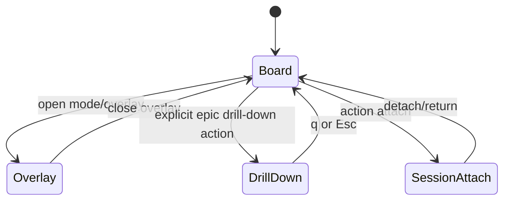
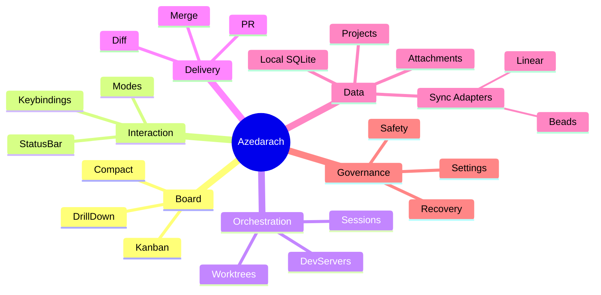

# 01 - Product Definition

## 1.1 Product Statement

Azedarach is a terminal user interface that orchestrates parallel AI coding sessions against issue-tracked work, using git worktrees and tmux as execution substrates.

The product value is not code generation itself, but high-throughput coordination:

- discover ready work
- start isolated execution contexts
- observe session state at a glance
- intervene quickly when sessions stall
- land work through Git/PR workflows

## 1.2 Problem Space

Teams running many concurrent coding tasks in AI-assisted workflows face coordination bottlenecks:

- difficult parallel visibility across many sessions
- slow context switching between issue management state and terminal sessions
- inconsistent branch/worktree lifecycle hygiene
- fragile merge/pr handoffs
- poor observability when sessions ask questions or fail

Azedarach solves this by making the board the command center.

## 1.3 Core Outcomes

### O-01 Throughput

- Increase number of concurrent active tasks without loss of control.

### O-02 Controllability

- Enable one-keystroke intervention on any active session.

### O-03 Predictable State

- Keep task state, session state, and git state visible and recoverable.

### O-04 Low Friction

- Minimize command and mode depth for common actions.

### O-05 Iterative UX Improvement

- The product SHOULD preserve core workflow intent while improving known rough edges (especially bulk operations), provided safety and determinism contracts remain satisfied.

## 1.4 Primary Users

### Persona A: Solo AI-Orchestrator Engineer

- runs multiple workstreams in one repository
- optimizes for speed and low handoff overhead

### Persona B: Tech Lead Supervising Parallel Work

- monitors progress across many issues
- intervenes on blockers and merge risks

### Persona C: Agentic Workflow Operator

- uses planning, forks, and bulk operations to structure large epics

## 1.5 Product Boundaries

### In Scope

- board-centric issue interaction
- keyboard-first modal navigation
- tmux-backed session orchestration
- worktree lifecycle operations
- PR and merge orchestration
- local config/settings overlays
- filters, sorting, search, and project switching

### Out of Scope

- replacing core git/tmux execution surfaces
- replacing git hosting provider concepts
- introducing mandatory GUI workflows
- forcing a specific programming-language stack for implementation

## 1.6 Canonical Domain Objects

### D-01 Issue

Fields (canonical minimum):

- ID
- title
- status
- type
- priority
- description
- design
- notes
- created/updated timestamps

### D-02 Session

- maps to a tmux session associated with an issue
- has lifecycle state independent from issue status

### D-03 Worktree

- isolated git checkout tied to an issue branch

### D-04 Project

- registered root containing an Azedarach local issue store and git repo

### D-05 Attachment

- image artifact linked to issue context

### D-06 Dependency Edge

- directed relationship between two issues
- supports multiple relation types (for example: blocks, depends-on, discovered-from, parent-child, related)
- dependency model is graph-based and MUST NOT be limited to a single parent/child tree

## 1.7 Status Taxonomy

### Issue Status (board columns)

- Open
- In Progress
- Blocked
- Closed

### Session Status (overlay/card indicators)

- Idle
- Busy
- Waiting
- Done
- Error
- Paused

Rationale: issue status answers workflow stage; session status answers execution state.

## 1.8 Information Hierarchy

Top-level UI priorities:

1. current cursor context
2. board state and card metadata
3. mode and command affordances
4. toast/alert feedback
5. deep details in overlays/panels

## 1.9 Design Principles

### P-01 Home-Row Efficiency

Primary operations MUST be accessible via home-row-centric keymaps.

### P-02 Mode Visibility

Current mode MUST always be visible in the status bar.

### P-03 Graceful Failure

Operations SHOULD fail loudly but recoverably.

### P-04 Batch Power

Power users MUST be able to apply actions across many tasks.

### P-05 Context Preservation

Returning from overlays or drill-down SHOULD restore meaningful cursor state.

## 1.10 User Experience Constraints

- no pointer required for core flows
- no hidden side effects on destructive actions
- low-latency interactions under large task sets
- clear distinction between local-only actions and remote/network actions

## 1.11 Success Metrics

- time-to-start-session from focused card <= 3 key events
- time-to-attach-to-waiting-session <= 3 key events
- ability to locate any visible task with jump labels in <= 3 events after activation
- no ambiguous mode state during keyboard interaction

## 1.12 High-Level State Model

## 1.13 Canonical User Stories

### US-01 Start Parallel Work

As an engineer, I can start sessions on multiple open tasks so work progresses in parallel.

### US-02 Recover Stalled Session

As an engineer, I can see waiting/error states and attach instantly to unblock.

### US-03 Keep Branches Healthy

As a lead, I can sync from the configured base branch, resolve conflicts, and create PRs from the board.

### US-04 Triage at Scale

As an operator, I can search, filter, sort, and batch-manage dozens of issues quickly.

### US-05 Organize Epics

As a planner, I can drill into epic children and track completion progress clearly.

### US-07 Manage Real Dependency Graphs

As an operator, I can inspect and update issue dependencies beyond epic hierarchy so blocking and discovery relationships remain accurate.

### US-08 Continue Work Without Main-Hop

As an engineer, I can merge upstream-related work directly into my issue branch to continue implementation without routing through the base branch.

### US-06 Context-Rich Work

As an engineer, I can attach images/screenshots so sessions have visual context.

## 1.14 Non-Functional Expectations

- responsiveness suitable for large boards
- deterministic key handling
- robust behavior in non-interactive/CI-like shell environments
- safe handling of credentials and local config files
- clear compatibility requirements for git/tmux/gh/linear-cli/ai-cli tooling

## 1.15 Compatibility Envelope

Minimum external capabilities required:

- terminal emulator supporting interactive keyboard input
- tmux available and functional
- git worktree operations supported
- writable local filesystem for project-local Azedarach SQLite stores at `<project-root>/.azedarach/azedarach.db`
- AI CLI available and authenticated
- optional gh for PR workflows
- optional linear-cli and/or Beads adapter tooling when sync targets are enabled

## 1.16 Product-Level Constraints

- TUI frontend is mandatory.
- Product behavior must not depend on mouse-only interactions.
- Task data persistence must preserve canonical local schema and adapter contract semantics.
- Session naming and lookup must be deterministic from issue identity.

## 1.17 Decomposition View

## 1.18 Versioning Guidance

If future product variants change keybindings or mode semantics, they MUST:

- declare a named interaction profile
- preserve backward-compatible profile as optional mode OR version bump spec major
- provide migration notes and mapping tables

## 1.19 Completion Criteria for This Spec Section

This section is complete when a reader can answer:

- what Azedarach is for
- who it serves
- what must be preserved in any conforming implementation
- where behavior boundaries and non-goals are
