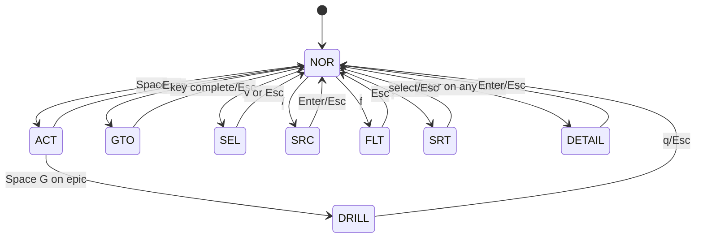

# 02 - Interaction and Visual Spec

## 2.1 Interaction Contract

The interaction model is modal and keyboard-first.

At any moment, exactly one primary mode is active:

- `NOR` Normal
- `ACT` Action
- `GTO` Goto
- `SEL` Select
- `SRC` Search
- `FLT` Filter
- `SRT` Sort
- contextual overlays (detail/settings/help/planning/etc.)

The status bar MUST show active mode abbreviation.

## 2.2 Global Keyboard Rules

- `Esc` SHOULD back out one level of modal depth.
- `q` SHOULD close overlays; in board context it quits or exits drill-down.
- Arrow keys MAY mirror hjkl for baseline navigation.
- Non-applicable keypresses SHOULD be ignored without crashing.

## 2.3 Board Navigation

| Key | Behavior | Notes |
|---|---|---|
| `h` | move left column | wraps allowed by implementation profile |
| `j` | move down card | virtual scroll aware |
| `k` | move up card | virtual scroll aware |
| `l` | move right column | wraps allowed by implementation profile |
| `Left` | same as `h` | optional fallback |
| `Down` | same as `j` | optional fallback |
| `Up` | same as `k` | optional fallback |
| `Right` | same as `l` | optional fallback |
| `Ctrl-Shift-d` | half-page down | large lists |
| `Ctrl-Shift-u` | half-page up | large lists |

## 2.4 Normal Mode Keys

| Key | Action | Result |
|---|---|---|
| `Enter` | open detail | detail panel for focused issue (including epics) |
| `Space` | enter action mode | `ACT` |
| `,` | enter sort mode | `SRT` |
| `f` | enter filter mode | `FLT` |
| `/` | enter search mode | `SRC` |
| `g` | enter goto mode | `GTO` |
| `v` | enter select mode | `SEL` |
| `Tab` | toggle view | Kanban <-> Compact |
| `r` | refresh git stats | update git metadata |
| `p` | open planning | planning overlay |
| `c` | create manual | editor or creation flow |
| `C` | create via AI | prompt overlay/session |
| `s` | settings | settings overlay |
| `?` | help | help overlay |
| `L` | logs | logs overlay/menu |
| `Ctrl-l` | redraw | full repaint |
| `q` | quit/back | app exit or view back |

## 2.5 Goto Mode (`g` prefix)

| Sequence | Action |
|---|---|
| `g g` | jump to top of current column |
| `g e` | jump to bottom of current column |
| `g h` | jump to first column |
| `g l` | jump to last column |
| `g w` | show jump labels, then jump by two-char code |
| `g p` | open project selector |
| `g s` | open Spec workspace |

### Jump Labels

- Labels are generated for visible cards.
- Labels SHOULD prioritize home-row keys (e.g., `a s d f g h j k l ;`).
- Typing a valid two-char label MUST move cursor to target card.

## 2.5a Spec Workspace

The Spec workspace is a dedicated keyboard-first view for spec operations.

Entry/exit contract:

- `g s` from board enters Spec workspace.
- `Esc` exits Spec workspace and returns to prior board context.
- `q` MAY mirror `Esc` in Spec workspace.

Subview contract:

- Spec workspace includes `Requirements`, `Coverage`, and `Publish` subviews.
- `Tab` cycles subviews in deterministic order:
  - Requirements -> Coverage -> Publish -> Requirements
- status bar and key-hint surfaces MUST show active workspace and subview.

## 2.6 Select Mode (`v`)

| Key | Action |
|---|---|
| `a` | toggle current card selection |
| `A` | select all in current column |
| `%` | select all visible non-tombstoned tasks |
| `*` | invert selection for visible non-tombstoned tasks |
| `x` | clear selection and remain in Select mode |
| `h/j/k/l` | navigate while retaining selections |
| `Space` | enter action mode for selected set |
| `v` | exit select mode and clear selections |
| `Esc` | exit select mode and clear selections |

Selection count MUST be visible in status area when non-zero.

Selection UX contract:

- status area SHOULD show `selected total`, `visible selected`, and `hidden selected` counts when applicable
- selection membership is ID-based and should remain stable across sort/refresh/filter changes unless explicit clear action is used
- entering action mode from Select SHOULD show a compact target preview (count + scope) before destructive bulk actions

## 2.7 Search Mode (`/`)

Behavior:

- live filter while typing
- match against issue ID and title
- case-insensitive by default
- `Enter` commits active query and returns to normal mode
- `Esc` clears query and exits mode

## 2.8 Filter Mode (`f`)

Top-level filter keys:

| Key | Filter Dimension |
|---|---|
| `s` | issue status |
| `p` | priority |
| `t` | issue type |
| `S` | session state |
| `e` | hide/show epic children |
| `1` | age > 1 day |
| `7` | age > 7 days |
| `3` | age > 30 days |
| `0` | clear age filter |
| `c` | clear all filters |
| `Esc` | exit filter mode |

Submenus:

### Status Submenu

- `o`: open
- `i`: in_progress
- `b`: blocked
- `d`: closed

### Priority Submenu

- `0`..`4`: toggle P0..P4

### Type Submenu

- `B` bug
- `F` feature
- `T` task
- `E` epic
- `C` chore

### Session Submenu

- `I` idle
- `U` busy
- `W` waiting
- `D` done
- `X` error
- `P` paused

Combination logic:

- OR within same dimension
- AND across dimensions

## 2.9 Sort Mode (`,`)

| Key | Primary Sort |
|---|---|
| `s` | session state |
| `p` | priority |
| `u` | updated time |

Rules:

- pressing same sort key again toggles ascending/descending
- implementation SHOULD preserve stable tiebreakers
- current sort and direction SHOULD be visible in sort UI

## 2.10 Action Mode (`Space`)

Action mode is a palette of context-sensitive operations.

### Session Actions

| Sequence | Behavior |
|---|---|
| `Space s` | start session |
| `Space S` | start session with default work prompt and injected az issue context |
| `Space !` | start session with skip-permission behavior |
| `Space c` | start chat session (short-context model profile) |
| `Space a` | attach to existing session |
| `Space p` | pause session |
| `Space R` | resume paused session |
| `Space x` | stop session |

### Dev Server Actions

| Sequence | Behavior |
|---|---|
| `Space r` | toggle dev server for focused issue |
| `Space v` | attach/view dev server session |
| `Space Ctrl-r` | restart dev server |

### Git / PR Actions

| Sequence | Behavior |
|---|---|
| `Space u` | update branch from configured base branch |
| `Space f` | show diff versus merge base |
| `Space P` | create PR |
| `Space O` | open PR in browser |
| `Space m` | context merge: default merge to configured base branch; in relationship-follow context merge selected upstream source into focused issue branch |
| `Space M` | abort ongoing merge |
| `Space b` | merge issue branch into another issue branch |
| `Space d` | cleanup/delete worktree (and optionally close issue) |

### Editing and Authoring Actions

| Sequence | Behavior |
|---|---|
| `Space e` | edit issue manually |
| `Space E` | edit issue via AI assistant |
| `Space F` | fork issue (child/sibling/new epic relation) |
| `Space G` | open epic child-board drill-down (epic only) |
| `Space H` | open editor (Helix-style action) in task context |
| `Space i` | image attachment overlay |

### Movement Actions

| Sequence | Behavior |
|---|---|
| `Space h` | move issue left status |
| `Space l` | move issue right status |

## 2.11 Epic Drill-Down Visual Contract

Epic drill-down is an explicit action, not a replacement for detail behavior.

Entry paths:

- `Space G` on focused epic card
- `g` from epic detail panel

Header MUST include:

- back affordance with epic ID
- epic title
- progress metric closed/total
- optional progress bar glyphs

Exit keys:

- `q`
- `Esc`

Cursor restoration SHOULD return focus to epic card in parent board.

## 2.12 Detail Panel Contract

Detail panel on `Enter` SHOULD include for all issue types (including epics):

- issue identity and title
- type, priority, status
- description/design/notes
- session metadata if present
- attachment list if present
- dependency summary (incoming/outgoing counts and relation-type breakdown)

Additional epic behavior in detail panel:

- show child-count/progress summary when issue is epic
- allow drill-down entry via `g`

Additional dependency behavior in detail panel:

- dependency list supports selecting typed upstream/downstream relations for current issue
- `m` on selected eligible upstream source SHOULD invoke follow-on merge into current issue branch (without routing via base branch)

Panel behavior:

- `Ctrl-u` / `Ctrl-d` scroll body
- `j`/`k` navigate attachment selection if available
- `v` preview selected image
- `o` open selected image externally
- `x` delete selected attachment
- `i` add attachment
- `Enter` or `Esc` close panel

## 2.13 Planning Overlay Contract

Input phase:

- free text prompt
- `Enter` submits
- `Esc` cancels

Execution/review phase:

- visible progress state
- `a` MAY attach to planning session
- `Esc` MAY cancel if safe

Completion phase:

- explicit success/error message
- `Enter`, `Esc`, or `q` closes

Outcome expectation:

- creates epic and decomposed child tasks with dependencies when appropriate

## 2.14 Settings Overlay Contract

Settings view MUST support keyboard-only changes and persistence.

Navigation:

- `j`/`k` move selection
- `Space` or `Enter` toggle/cycle value
- `e` open raw config in editor
- `Esc` close

Settings domains:

- ai cli tool selection
- permission-skipping toggle
- git push/fetch behavior
- PR defaults
- notifications
- network auto-detection
- linear sync behavior
- session state detection mode
- diff presentation preferences

## 2.15 Logs / Help / Diagnostics Overlays

### Help Overlay

- invoked by `?`
- must summarize key modes and common actions
- dismissed with any key or `Esc`

### Logs Overlay

- invoked by `L`
- can offer view/edit/quit style options
- must not trap user without obvious exit
- SHOULD expose an operations monitor view for background jobs
- operations monitor SHOULD show per-operation state, step, and cancel affordance when supported

### Diagnostics Overlay (if present)

- should show environment health and dependency checks

### Machine-Readable Probe Surface

- app SHOULD expose a side-effect-free state probe suitable for automated E2E assertions
- probe output SHOULD include mode/focus/view, key visible entities, and operation queue summary

### Visual Snapshot Surface

- app SHOULD support deterministic full-screen snapshot capture in test profiles
- snapshot baseline comparison SHOULD assert cell-level rendering fidelity for approved states

## 2.16 Board Views

### Kanban View

- columns by issue status
- card density optimized for scanning
- scroll indicators when overflow exists
- cards SHOULD include compact relationship chips (for example `UP`, `DN`, `BLK`) when relationships exist

### Compact View

- row-based list across statuses
- emphasizes sortable metadata columns
- toggled by `Tab`

Status bar SHOULD include short indicator such as `KAN` or `LST`.

## 2.17 Card Visual Semantics

Each card SHOULD expose:

- priority marker
- issue ID and truncated title
- optional type badge
- optional session-state icon
- optional PR indicator
- optional dev-server indicator
- optional relationship summary chips

Suggested icon mapping:

- busy: blue dot
- waiting: yellow dot
- done: check
- error: cross
- paused: pause glyph
- session icon state SHOULD track recent telemetry and recover from transient error states when newer activity indicates resumed execution

## 2.18 Relationship Surfaces

Main board relationship contract:

- relationship chips stay compact by default and avoid full edge-list noise
- hard-blocked/dependency-unsatisfied state remains explicit even when chips are collapsed

Relationship detail contract:

- detail panel shows typed incoming/outgoing edges with direction
- relation groups SHOULD include execution, hierarchy, lineage, and related categories

Drill-down relationship contract:

- epic child-board remains default scope
- relation-scope switching MAY show upstream/downstream/mixed typed slices for focused context
- relation-scope changes MUST preserve deterministic focus behavior

## 2.19 Status Bar Requirements

Status bar MUST provide:

- app/project identity
- connectivity state
- mode tag
- compact key hints
- optional selection count
- optional filter/search summary

## 2.20 tmux Navigation Interop

When integrated with tmux navigation conventions:

- `Ctrl-a Ctrl-a` returns to board session
- `Ctrl-a Tab` toggles between AI session and related dev-server session
- hook- or PTY-driven `waiting` state SHOULD surface tmux-native attention highlighting (bell/alert style) so `prefix+s` can reveal sessions awaiting user input

If unavailable, product SHOULD degrade gracefully and provide guidance.

## 2.21 Interaction State Machine

## 2.22 Bulk Operation Behavior

When selections are active, compatible actions MUST apply to selected set.

Bulk-safe actions include:

- move left/right
- stop sessions
- cleanup worktrees

Bulk cleanup SHOULD present choice dialog:

- worktrees only
- full cleanup (worktrees + issue closure)
- cancel

## 2.23 Interaction Accessibility in Terminal Context

- Avoid requiring shifted symbols for critical frequent actions beyond established mappings.
- Maintain deterministic focus behavior when overlays open/close.
- Keep key sequence latency low and predictable.
- Provide textual equivalents for icon-only signals.

## 2.24 Input Validation Rules

- Project selector numeric keys MUST map only to visible options.
- Search/filter input MUST handle backspace and empty state safely.
- Path input for attachment MUST validate path existence/readability before attach.
- Invalid action contexts SHOULD produce toast/feedback rather than silent failure.
