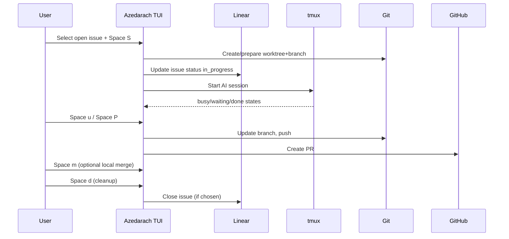

# 03 - Workflow Spec

## 3.1 Workflow Overview

This section defines canonical end-to-end workflows and state transitions.

Workflows are written as behavior contracts, not implementation details.

## 3.2 Start Session Workflow

### Trigger

- user focuses issue card
- user invokes `Space s`, `Space S`, or `Space !`

### Preconditions

- issue exists in current project
- issue is eligible for session start (not tombstoned)

### System Steps

1. ensure task-scoped worktree exists or create it
2. if task branch is missing, present runtime branch-origin chooser:
   - create from configured base branch
   - create from selected upstream-related issue branch (when eligible sources exist)
3. ensure task-scoped branch exists and is checked out
4. optionally sync tracker state for new context
5. update issue status to in_progress when needed
6. spawn/ensure task tmux session
7. launch selected AI CLI command
8. reflect session state as busy/idle/waiting as telemetry arrives

### Variants

- `Space S` injects default work prompt
- `Space !` injects skip-permissions mode
- `Space c` launches chat-oriented profile

### Postconditions

- session exists and is discoverable
- board card shows active session indicator

## 3.3 Attach Workflow

### Trigger

- `Space a` on issue with session

### Main Path

1. check session existence
2. if branch behind configured base branch and policy enables prompt, offer update action
3. attach terminal client to target tmux session
4. support detach-and-return path to board

### Failure Paths

- no tmux session found -> show actionable error
- terminal spawn fails -> show retry guidance

## 3.4 Pause / Resume / Stop

### Pause (`Space p`)

- interrupt running process safely
- persist WIP context where possible
- mark session paused

### Resume (`Space R`)

- restart command in same task context
- preserve history and worktree continuity

### Stop (`Space x`)

- terminate session process
- keep worktree unless user performs cleanup

## 3.5 Dev Server Workflow

### Toggle (`Space r`)

If stopped:

1. select/allocate ports for worktree
2. start server command in dedicated tmux session
3. publish startup state and status bar indicator

If running:

1. stop server process/session
2. clear active indicator

### View (`Space v`)

- attach to dev server tmux session

### Restart (`Space Ctrl-r`)

- stop then start
- preserve expected port mapping for issue context

## 3.6 Git Update from Base Branch Workflow (`Space u`)

### Main Path

1. fetch latest configured base branch
2. merge/rebase base branch into task branch per profile
3. if conflict-free, complete and notify success

### Conflict Path

1. detect conflicts
2. present conflict state
3. optionally spawn assistant session for conflict resolution
4. provide abort path (`Space M`)

### 3.6 Variant: Bulk Bring-Up-To-Date

### Intent

Update many issue branches in one run by merging the appropriate upstream source into each issue branch.

### Source Resolution Policy

For each queued issue item, source branch resolves as:

1. configured base branch by default
2. eligible parent/upstream-related branch when invoked from relation-aware context and policy allows

### Main Path

1. user chooses issue set (selection/filter scope) and invokes bulk bring-up-to-date action
2. system creates FIFO queue of target issues in deterministic order
3. queue executes with bounded max concurrency
4. each item resolves source branch per policy and runs update merge flow
5. per-item result is recorded as success/failed/conflict-resolved/conflict-unresolved
6. completion summary shows per-item outcomes and next actions

### Conflict Handling

1. if conflict occurs on an item and conflict-assistant policy is enabled, enqueue automated conflict-resolution assistant attempt for that item
2. if assistant resolves conflict, continue queue processing
3. if assistant fails or allowed attempts are exhausted, keep item recoverable and emit manual-resolution guidance
4. queue continues with remaining items regardless of individual failure

## 3.7 Create PR Workflow (`Space P`)

### Main Path

1. ensure branch is up-to-date from configured base branch (or run update flow)
2. push branch if needed
3. create PR using configured defaults (draft/ready)
4. store PR metadata on issue context
5. update card PR indicator

### Failure Modes

- network unavailable
- auth missing/expired
- remote push rejected
- PR already exists

Each failure MUST return explicit remediation guidance.

## 3.8 Open PR Workflow (`Space O`)

### Preconditions

- PR metadata exists for issue

### Behavior

- open PR URL in default browser OR fallback to printed URL if unsupported

## 3.9 Merge to Base Branch Workflow (`Space m`)

### Main Path

1. evaluate potential conflicts against configured base branch
2. if conflict risk detected, show confirmation dialog
3. perform merge attempt in safe context
4. if success, notify and keep worktree/session alive for iterative merges

### Abort Path

- user can cancel pre-merge confirmation

### Conflict Path

- report failure and keep repository recoverable
- offer conflict resolution or abort merge action

## 3.10 Abort Merge Workflow (`Space M`)

### Behavior

1. detect ongoing merge state
2. run merge abort operation
3. restore pre-merge working tree state
4. report result

If no merge in progress, show no-op notification.

## 3.11 Merge Bead Into Bead Workflow (`Space b`)

### Intent

Move source branch work into target branch without routing through base branch.

### Flow

1. user marks source issue and enters merge-select mode
2. user navigates to target issue
3. user confirms merge target
4. system ensures target worktree exists
5. system merges source branch into target branch
6. on success, source issue may be auto-closed per policy

### Guardrails

- source and target cannot be same issue
- must handle conflicts with clear recovery path

## 3.12 Cleanup Workflow (`Space d`)

### Single Issue

- remove task worktree
- optionally delete branch
- optionally close issue based on selected mode

### Bulk Issues

- operate on all selected issues
- show choice dialog:
  - worktrees only
  - full cleanup (worktrees + close issues)
  - cancel

### 3.12 Refinement: Bulk Selection

### Intent

Make large multi-issue selection predictable before executing bulk actions.

This section is normative for outcome quality; implementations MAY choose different interaction details as long as safety, determinism, and clarity requirements are satisfied.

### Main Path

1. user enters Select mode (`v`) and composes selection with `a`, `A`, `%`, `*`, and navigation
2. status bar updates selected counts, including hidden selected count when filters/scope hide selected IDs
3. user may clear without exiting Select mode (`x`) to restart selection quickly
4. user enters Action mode (`Space`) for selected set
5. for destructive bulk actions, system shows target preview (count + scope + notable exclusions)
6. execution target set freezes at run start and operations apply against frozen IDs
7. if drift occurs (deleted/invalid/now-ineligible IDs), summary reports skipped IDs and reasons

### Guarantees

- selection set is deterministic and ID-based across refresh/sort/filter changes
- user can always distinguish visible vs hidden selected membership
- destructive bulk actions are never applied to an ambiguous target set

## 3.13 Move Issue Left/Right Workflow (`Space h/l`)

### Behavior

- left: move toward earlier status
- right: move toward later status
- support bulk movement for selected set
- update tracker immediately on success

### Constraints

- cannot move past terminal status boundaries
- blocked dependency rules may prevent movement to done/closed states

## 3.14 Epic Drill-Down Workflow

### Enter

- `Space G` on epic card OR `g` from epic detail panel

### Board Transformation

- board filters to epic children
- shows drill-down header with progress

### Exit

- `q` or `Esc` returns to parent board
- restore previous cursor to epic

## 3.15 Planning Workflow (`p`)

### Input

- user provides natural-language feature request

### Generation

- assistant session generates structured plan

### Review Loop

- iterative refinement up to configured limit
- optimize decomposition and dependencies

### Materialization

- create epic and linked tasks
- establish dependency graph

### Completion

- success summary with created IDs
- failure summary with retry options

## 3.16 Create/Edit Issue Workflows

### Manual Create (`c`)

- open editable template
- parse fields on save
- create issue via tracker command

### AI Create (`C`)

- capture natural language request
- spawn assistant session to create issue

### Manual Edit (`Space e`)

- open existing issue in editable form
- apply updates on save

### AI Edit (`Space E`)

- pass current issue context to assistant
- assistant performs updates through tracker

## 3.17 Attachment Workflow (`Space i`)

### Add

- choose paste from clipboard or file path
- validate image input
- store attachment and index metadata

### Browse

- detail panel supports selection and navigation

### Preview

- render in-terminal when possible

### Open External

- open selected image in system viewer

### Remove

- delete attachment file and metadata reference

## 3.18 Multi-Project Workflow (`g p`)

### Switch

1. open project selector
2. choose target project
3. reload board against selected project context

### Auto-Selection on Startup

Priority:

1. current directory match
2. configured default project
3. first registered project

## 3.19 Search/Filter/Sort Composition Workflow

Rules:

- search query combines with structured filters (AND)
- sorting applies after filtering
- selections persist only for currently visible issue IDs unless policy states otherwise

## 3.20 Session State Detection Workflow

### Inputs

- AI session output patterns
- tmux option/status markers

### Mapping

- detected states update card indicators and optional notifications

### Typical Triggers

- waiting: assistant asks user question
- done: completion phrase or explicit end marker
- error: command failure markers

## 3.21 Notifications Workflow

Notification channels MAY include:

- in-app toast
- terminal bell
- system notification

Notification policy SHOULD be configurable per channel.

## 3.22 End-to-End Happy Path

## 3.23 High-Risk Workflow Surfaces

- merge to base branch
- full cleanup with issue closure
- yolo start mode
- bulk destructive operations

These workflows MUST include explicit user feedback and safety checks.

## 3.24 Workflow Timeouts and Retries

System SHOULD define timeouts for:

- CLI calls to tracker/git/gh
- session attach attempts
- planning generation phase

Retries SHOULD be bounded and visible to user.

## 3.25 Workflow Auditability

User-visible logs SHOULD capture:

- started/stopped sessions
- branch and merge operations
- PR create/open outcomes
- cleanup actions
- failures with root command context

## 3.26 Startup and Re-entry Workflow

### Startup Health Check

1. detect required external tools and project validity
2. if mandatory tooling missing, enter diagnostics-first board state with blocked actions
3. load last known stable board snapshot if tracker refresh is temporarily unavailable

### Context Restore

When same project was active in previous run, app SHOULD restore:

- last view mode (kanban/list)
- last non-empty search/filter/sort profile
- last focused issue if still present

If restored focus target no longer exists, app MUST choose nearest valid fallback and show non-blocking notice.

## 3.27 Graceful Shutdown Workflow

### Trigger

- user exits board (`q`) or host process receives normal termination signal

### Behavior

1. close overlays and flush pending toasts/log writes
2. persist restorable UI context (view, filters, sort, focus hint)
3. do not terminate task sessions/dev servers unless user explicitly requested stop
4. ensure terminal is restored to clean state without orphaned mode indicator

## 3.28 Stale Edit Conflict Workflow

### Trigger

- user opens manual edit/create flow
- issue is modified externally before save

### Conflict Path

1. detect revision mismatch on save attempt
2. present three-way choice: reload remote, overwrite with local draft, cancel and keep draft open
3. preserve user draft text unless user explicitly discards

### Postcondition

- no silent overwrite of externally updated issue fields

## 3.29 Background Refresh Coordination Workflow

Rules:

- periodic/manual refresh MUST not dismiss active text input overlays
- refresh may update non-edit surfaces while edit overlays remain authoritative for local draft values
- once overlay closes, board re-synchronizes and revalidates focus/selection

## 3.30 Tracker Lock Contention Workflow

### Trigger

- tracker command returns lock/busy indicator

### Behavior

1. show lock contention message including command intent
2. retry with bounded backoff for non-destructive reads
3. for writes, ask user to retry explicitly after lock clears
4. never apply duplicate writes optimistically without confirmation

## 3.31 Destructive Operation Preflight Workflow

Applies to:

- full cleanup with issue close
- merge to base branch
- attachment delete

Preflight sequence:

1. recompute current target set from live IDs
2. display concrete impact summary (items touched, closures, branch/worktree effects)
3. require explicit confirm/cancel choice
4. execute only against validated targets

Postcondition:

- canceled preflight yields zero side effects.

## 3.32 Remote Divergence Reconciliation Workflow

### Trigger

- push/update operation reports non-fast-forward or remote-ahead state

### Behavior

1. surface divergence reason in user terms
2. offer guided path to sync from base branch and/or rebase/merge target branch per policy
3. preserve local changes and operation intent for retry
4. on retry success, continue original workflow step (PR create or update)

## 3.33 Orphan Session Reconciliation Workflow

### Trigger

- session indicator says running but tmux session lookup fails, or tmux session exists without board metadata

### Behavior

1. run reconciliation scan on issue and session naming map
2. if orphan tmux exists, offer attach/adopt/terminate choices
3. if stale indicator exists, clear indicator and log reconciliation event
4. keep board interactive during reconciliation

## 3.34 Deterministic Sort and Clock-Drift Workflow

Rules:

- when primary sort field ties or is missing, apply deterministic secondary order (priority, then ID)
- if updated timestamps appear out-of-order due to clock skew, show consistency hint and keep stable deterministic order
- repeated refresh MUST not reorder equal-ranked items nondeterministically

## 3.35 Dependency Graph Workflow

### Scope

Dependency handling is graph-oriented and includes, but is not limited to, epic parent/child links.

Canonical upstream relation direction (source -> target):

- `blocks`: blocker -> blocked
- `depends-on`: dependency -> dependent
- `parent-child`: parent -> child
- `discovered-from`: discovered source -> discovered issue
- `related`: non-directional for visibility; NOT upstream-eligible unless explicitly promoted by policy

### Inspect Dependency Context

1. user opens issue detail
2. system shows incoming and outgoing dependency edges by type
3. user can identify upstream/downstream items and discovery lineage without leaving board context
4. user can inspect relation groups by type (execution, hierarchy, lineage, related)

### Create or Modify Dependency Edge

1. user invokes dependency edit path from issue context
2. user selects relation type and target issue
3. system validates relation semantics and duplicate-edge constraints
4. system persists edge and refreshes affected issue states/indicators

### Remove Dependency Edge

1. user selects existing edge
2. system requires explicit confirmation for destructive unlink
3. system removes edge and recalculates blocked/readiness indicators

## 3.36 Upstream Follow-On Merge Workflow

### Intent

Allow an issue to continue directly from upstream-related work without going through base branch.

### Trigger

- user focuses target issue
- user chooses eligible upstream dependency edge
- user invokes context merge (`Space m` in relationship-follow context)

Parent drill-down shortcut:

- in parent drill-down with child focused, `Space m` SHOULD preselect parent as upstream source

### Main Path

1. verify selected dependency is upstream to current issue per relation-direction rules
2. verify source branch/worktree is mergeable and relation-specific readiness requirements are satisfied
3. ensure target issue branch/worktree exists
4. merge source branch into target issue branch directly
5. report merge result and refresh dependency indicators

### Guardrails

- must not require intermediate merge through base branch
- if selected source does not satisfy readiness policy, action is blocked with guidance
- if multiple upstream sources exist, user chooses explicit source issue
- UI SHOULD provide suggested merge order for multiple upstream sources using deterministic heuristic (blocking-criticality, then updated recency, then issue ID)

Relation readiness policy (default contract):

- `blocks` / `depends-on`: source SHOULD be `closed` unless override policy allows `in_progress`
- `parent-child`: source MAY be `in_progress` when child continuation is intentional
- `discovered-from`: source MAY be `in_progress` when linking exploratory follow-on work
- `related`: no default follow-on merge eligibility unless explicitly elevated by policy

### Failure Path

- on conflicts, keep target branch recoverable and offer conflict resolution/abort guidance

## 3.37 Relationship Representation Workflow

### Main Board Representation

1. each card shows compact relationship chips (for example `UP:n`, `DN:n`, `BLK:n`) without rendering full edge lists
2. hard-blocking state remains visually explicit even when chips are collapsed
3. user can open focused issue detail to inspect full typed edge list

### Drill-Down Representation

1. drill-down remains epic-child scoped by default
2. relation scope toggle supports views such as children, upstream, downstream, or mixed typed context
3. focus and action semantics remain deterministic when switching relation scopes

## 3.38 Fork From Relationship Context Workflow

### Trigger

- user invokes `Space F` from issue context (including parent drill-down)

### Behavior

1. show fork-mode chooser (child/sibling/related as supported)
2. show runtime branch-origin chooser for new fork branch:
   - from configured base branch
   - from selected upstream-related issue branch
3. when invoked from parent drill-down and creating child, preselect parent as upstream source
4. persist selected dependency relationship(s) and create issue/branch accordingly
5. if branch creation is retried/recreated after branch loss or invalidation, re-open runtime branch-origin chooser

## 3.39 Optimistic Mutation Workflow

### Scope

Applies to user-facing mutations where fast feedback matters, including:

- issue create/edit/move/status change
- dependency add/remove/update
- fork metadata creation

Linear synchronization contract:

- linear remains source of truth for persisted state
- UI applies optimistic mutations immediately
- periodic/manual hydration polls reconcile non-local external changes
- hydration MUST NOT clobber locally pending optimistic updates

### Flow

1. validate input locally
2. apply optimistic in-memory state update immediately
3. enqueue async persistence operation
4. on success, confirm state and clear pending marker
5. on failure, rollback in-memory state to last confirmed snapshot and show error with next action

### Guarantees

- user never sees silent divergence between optimistic and persisted state
- rollback is explicit and observable in UI/logs

## 3.40 Background Operation Workflow

### Scope

Long-running or multi-step operations run in background job form, including:

- session start/resume
- update from base branch
- merge to base branch
- create PR
- cleanup

Default rule:

- any async action that is not required to block immediate UI interaction SHOULD run as background operation

### Lifecycle

1. create operation record with unique operation ID
2. show pending/running progress in operation monitor
3. allow user to inspect details and current step
4. allow cancel/abort where operation phase is cancellable
5. finalize as success/failed/canceled with durable result summary

### User Contract

- board remains interactive while jobs run
- operation status is discoverable without leaving board context
- cancellation behavior is explicit about what can and cannot be rolled back

## 3.41 Machine-Readable State Probe Workflow

### Purpose

Provide deterministic, automation-safe state introspection for E2E test harnesses.

### Probe Behavior

1. test runner requests probe snapshot
2. system returns side-effect-free structured payload
3. payload includes board focus, mode, visible cards, detail/overlay state, operation queue, and recent user-visible errors
4. probe response includes monotonic snapshot revision/timestamp

### Constraints

- probe MUST not mutate application state
- probe schema MUST be versioned and backward-compatible within a spec major version

## 3.42 Visual Snapshot Workflow for E2E

### Purpose

Enable full-screen correctness assertions for TUI rendering beyond state-only checks.

### Workflow

1. run deterministic fixture and terminal profile
2. drive key sequence to target UI state
3. capture screen snapshot (cell-grid/framebuffer equivalent)
4. compare against approved baseline snapshot for that profile
5. on mismatch, emit visual diff artifact and probe snapshot for diagnosis

### Constraints

- snapshots MUST be profile-scoped by terminal size, color capability, and font metrics assumptions
- snapshot assertions SHOULD be used with probe assertions for robust failure triage
