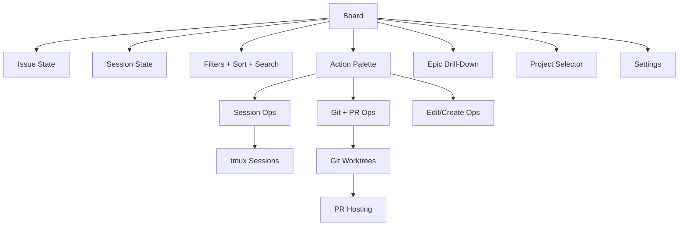

# Azedarach Complete Product Spec

This folder defines the canonical product specification for Azedarach.

It is implementation-agnostic and intended to be sufficient for any conforming implementation of Azedarach with the same behavior, interaction model, visual design intent, keybindings, and workflows.

## Scope

- Product: terminal-first Kanban orchestration tool for issue-centric parallel AI sessions
- Required client surface: terminal user interface (TUI)
- Required behavior: modal keyboard workflow, board views, session lifecycle, Git/PR workflows, and task management semantics
- Excluded by design: specific language/runtime/framework decisions, internal module boundaries, storage engine internals

## Reading Order

1. [01-product-definition.md](./01-product-definition.md)
2. [02-interaction-and-visual-spec.md](./02-interaction-and-visual-spec.md)
3. [03-workflow-spec.md](./03-workflow-spec.md)
4. [04-functional-requirements.md](./04-functional-requirements.md)
5. [05-edge-cases-and-failure-spec.md](./05-edge-cases-and-failure-spec.md)
6. [06-acceptance-catalog.md](./06-acceptance-catalog.md)
7. [07-glossary.md](./07-glossary.md)
8. [08-use-case-matrix.md](./08-use-case-matrix.md)
9. [09-keybinding-reference-normative.md](./09-keybinding-reference-normative.md)
10. [10-probe-schema-and-examples.md](./10-probe-schema-and-examples.md)
11. [11-golden-workflow-transcripts.md](./11-golden-workflow-transcripts.md)
12. [12-az-cli-json-schema-and-examples.md](./12-az-cli-json-schema-and-examples.md)

## Spec Structure

- `01`: product goals, personas, core concepts, and non-goals
- `02`: exact interaction contract (modes, keys, overlays, visual behavior)
- `03`: end-to-end user/system workflows and lifecycle transitions
- `04`: normative functional requirements with requirement IDs
- `05`: resilience, degradation, error handling, and safety behaviors
- `06`: executable acceptance scenarios and test matrix
- `07`: canonical terms and definitions
- `08`: detailed user/use-case catalog for implementers and QA
- `09`: complete normative keybinding table and conflict policy
- `10`: machine-readable probe schema and deterministic payload examples
- `11`: canonical high-risk workflow transcripts for validation
- `12`: canonical top-level `az` command JSON schema envelope and deterministic success/failure examples

## Normative Language

- MUST: mandatory behavior
- SHOULD: expected behavior unless a documented exception applies
- MAY: optional enhancement

## Product Invariants

- The app is keyboard-first; all primary workflows MUST be accessible without mouse.
- The app is modal; mode changes MUST be explicit and visible in status UI.
- The board is the source of truth for current workflow state presentation.
- Session state and issue state are related but distinct; both MUST be visible.
- Destructive actions MUST require explicit confirmation or use safe defaults.
- Recovery paths MUST exist for interrupted operations (merge conflicts, detached sessions, network failure).

## Canonical Feature Inventory (High-Level)

- Board views: Kanban and Compact list
- Modal navigation: Normal, Action, Goto, Select, Search, Filter, Sort, and contextual overlays
- Task operations: move status, edit, create, fork, filter, sort, search
- Bulk-select ergonomics: invert-visible selection, in-mode clear, hidden-selection awareness, and frozen target previews for destructive actions
- Epic workflows: child-board drill-down, progress header, and epic detail parity
- Session workflows: start, start+work, yolo start, chat, attach, pause, resume, stop
- Dev server workflows: toggle, view, restart, per-worktree ports
- Git workflows: update from configured base branch, bulk bring-up-to-date across issue sets, merge to base branch, abort merge, diff, merge source issue branch into target issue branch
- Branch-origin workflows: runtime choice between base branch and eligible upstream source branch
- PR workflows: create PR, open PR, PR status indicators
- Multi-project workflows: project registry, auto-detection, project selector
- Attachment workflows: add, remove, preview, open external
- Planning workflows: natural-language planning to epic+tasks+deps
- Settings workflows: full UI-driven configuration persisted to JSON config with schema-backed editor support
- Observability workflows: logs viewer, connection status, toast notifications
- Startup/re-entry workflows: dependency health checks and context restore
- Concurrency workflows: stale edit conflict handling and lock contention safety
- Terminal resilience workflows: narrow-width degradation and text-first status fallbacks
- Guardrail workflows: destructive-operation preflight and target revalidation
- Reconciliation workflows: remote divergence handling and orphan session recovery
- Dependency graph workflows: typed non-hierarchical relationships beyond epic-only links
- Follow-on merge workflows: merge eligible upstream source branches directly into target issue branches
- Relationship display workflows: compact graph chips on board and relation-scope drill-down views
- Issue lookup projection workflows: `az show` typed dependency counts by default with optional direct/verbose depth-limited projections
- E2E testability workflows: machine-readable state probe, deterministic fixtures, optimistic rollback checks
- Mutation semantics: optimistic UI updates with rollback-on-failure guarantees
- Async orchestration semantics: background operations with progress inspection and cancellation

## Visual/Interaction Design Intent

- Dense, information-rich terminal UI optimized for high-throughput keyboard operation
- Home-row-first command layout inspired by modal editors
- State communicated with both text and symbols (status chips, icons, mode tag)
- Persistent status bar with mode, connectivity, and key hints
- Fast context switching between board and tmux sessions

## Mermaid Map

## Traceability

Requirement IDs are in `04-functional-requirements.md` and are referenced by acceptance IDs in `06-acceptance-catalog.md`.

Format:

- Requirement: `AZ-FR-####`
- Acceptance scenario: `AZ-AT-####`

## Definition of Complete Implementation (from this spec)

An implementation is complete when:

- All MUST requirements in `04` pass mapped acceptance scenarios in `06`.
- No open P0/P1 requirement gaps remain.
- All keybindings in `02` are implemented with matching mode behavior.
- Session, git, and issue workflows are fully executable end to end.
- Documented failure handling in `05` is implemented and testable.
- Acceptance scenarios are automation-ready with deterministic fixtures and probe-backed assertions.
- High-risk workflows pass both probe assertions and visual snapshot assertions.
- Performance and stress E2E profiles pass configured latency/responsiveness budgets.
- Top-level `az` JSON command payloads conform to section `12` schema contract across success and failure paths.

## Data Model and Sync Topology

- Canonical issue state MUST be stored locally in Azedarach-managed SQLite.
- Canonical project DB path MUST be `<project-root>/.azedarach/azedarach.db` (one isolated DB per registered project).
- Internal canonical issue IDs MUST be prefix-agnostic and SHOULD remain short/typable via configurable generation strategy.
- Agent-facing issue retrieval and mutation commands MUST go through the top-level `az` CLI contract (`az init/show/create/q/update/close/reopen/delete/list/ready/blocked/search/stale/count`, `az dep ...`, `az config ...`, `az stats`, and project management via `az project add/list/remove/switch`).
- External trackers are optional sync targets, not runtime sources of truth.
- Linear is a first-class optional sync target and SHOULD prefer webhook-driven inbound updates over polling.
- Linear outbound sync MUST enforce internal throttling (30 requests per rolling minute with default burst allowance of 10 requests).
- A Beads sync adapter MAY be configured for projects that still mirror to Beads.
- Local mutations MUST update local canonical state first; outbound sync is asynchronous and must not block board interaction.

## Canonical E2E Fixture Profiles

- `smoke`: minimal dataset, key-path sanity checks.
- `integration`: representative mixed workflow graph with sessions/git/PR/dependencies.
- `scale`: high-cardinality issue graph for performance and stress behavior.
- `conflict`: merge and dependency conflict-heavy states.
- `network-failure`: offline/auth-expired/remote rejection conditions.
- `orphan-session`: tmux/session reconciliation edge conditions.

## Notes for Future Sessions

- Do not invent alternative key layouts unless explicitly versioned as a new interaction profile.
- If extending behavior, append new requirement IDs and update acceptance mappings.
- Keep the canonical glossary in sync before introducing new domain terms.
