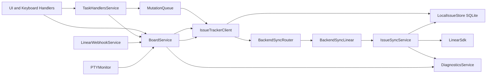
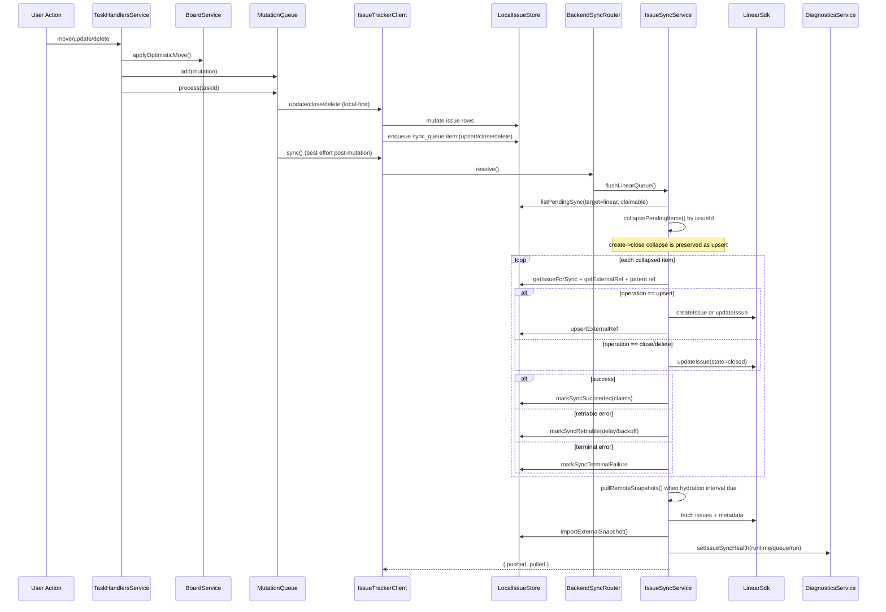
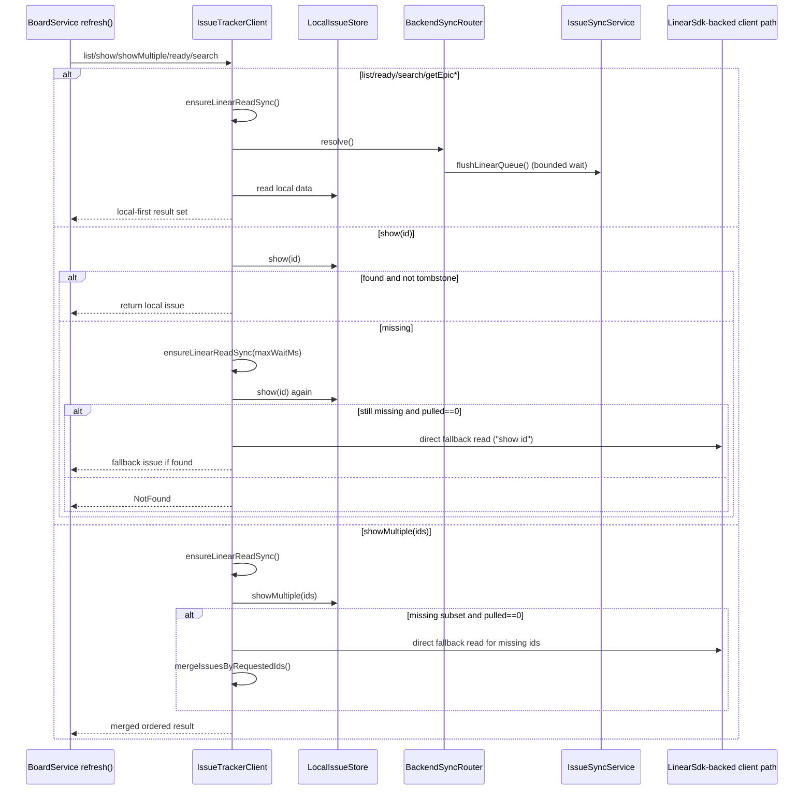
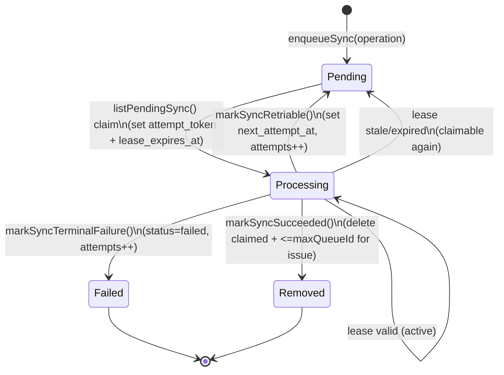
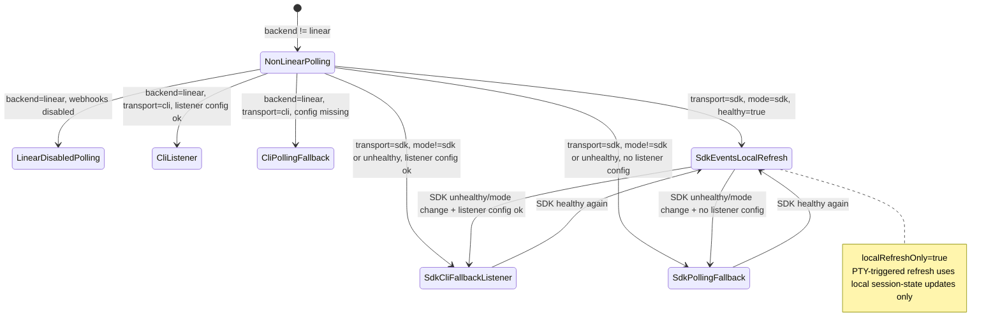
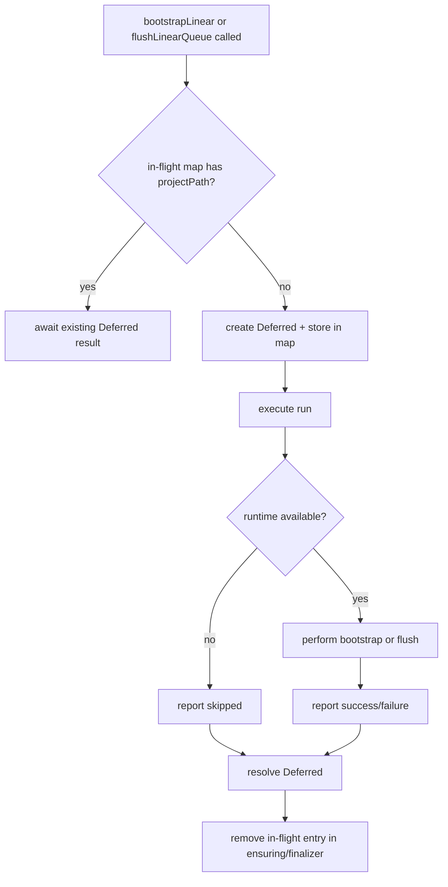

# External Sync Backend Internals (Linear, Local-First)

This document describes how the external sync backend works now, including all key internals in the `ts-opentui` path.

## Scope

- Local-first issue backend behavior for `issueTracker: linear`
- Mutation write path (`create`/`update`/`close`/`delete`) and sync queue processing
- Read path behavior (`list`/`show`/`showMultiple`/`ready`/`search`) with read-sync + fallback
- Board refresh triggers (background polling, SDK/CLI webhooks, PTY-triggered local refresh)
- Diagnostics + queue/runtime state reporting

## 1) Service and Dataflow Topology

## 2) Mutation Write Path (Optimistic -> Queue -> Linear)

## 3) Read Path (Local-First + Read Sync + Direct Fallback)

## 4) Sync Queue Lifecycle

## 5) Board Refresh Strategy State Machine

## 6) Bootstrap and Flush Concurrency Gates

## Internal Notes and Guards

- `IssueSyncService` de-duplicates concurrent bootstrap/flush per project path via in-flight `Deferred` maps.
- Hydration pull in flush is interval-gated (`LINEAR_REMOTE_HYDRATION_MIN_INTERVAL_MS = 60_000`), not triggered on every push.
- Parent-child mapping safety: child upsert is retried when parent local id exists but parent external ref is missing.
- Collapse safety: grouped `upsert + close` resolves to `upsert` so create-intent is not dropped before first sync.
- PTY-triggered board refresh is intentionally local-only (session state + PTY-derived fields only), not a remote backend sync trigger.
