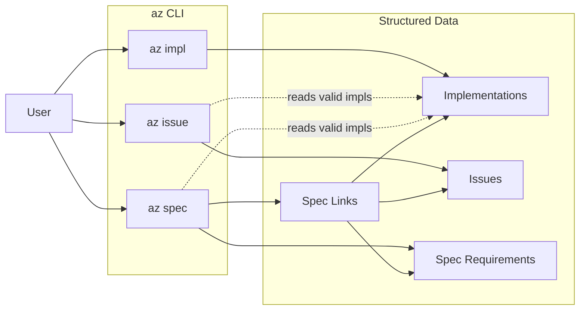
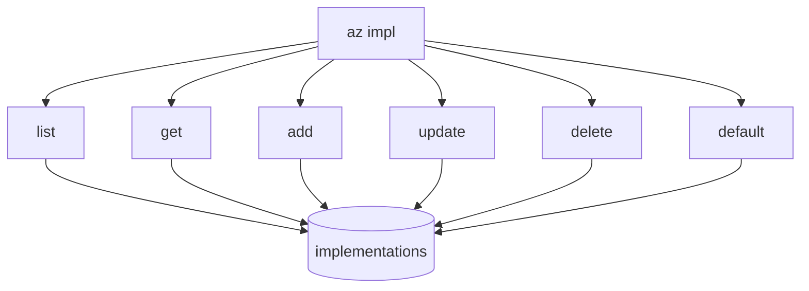
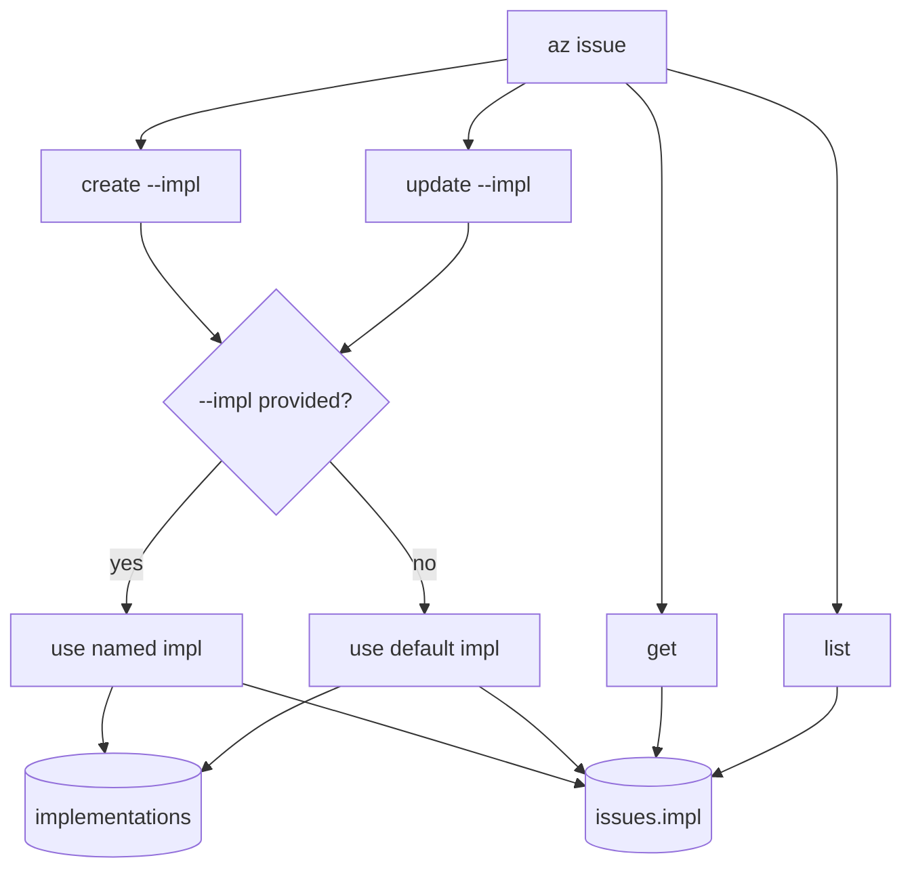
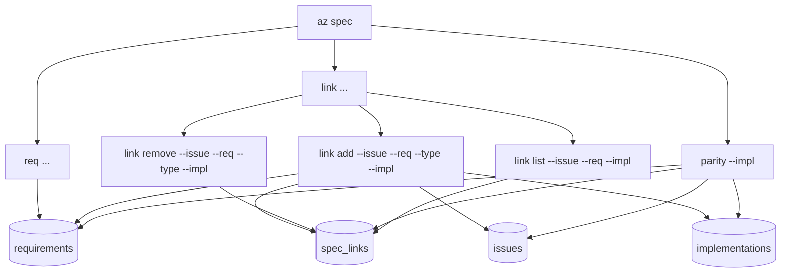
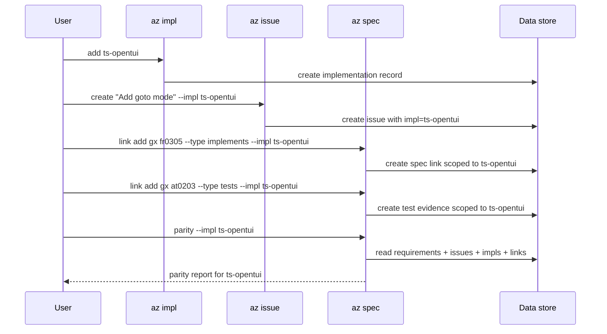

# Spec Parity Brainstorm

Date: 2026-03-10
Issue: `ia`

## Problem

We need a quick way to answer:

- what level of spec parity exists
- for which implementation
- based on what evidence

This matters once the repo has more than one implementation, for example:

- `default` or current primary implementation
- `ts-opentui`
- `go-bubbletea`

## Current State

Observed in the repo and local data:

- `az spec` has a large requirement corpus.
- `az spec link` coverage is still sparse relative to the total requirement count.
- `ts-opentui` already has a Spec workspace, but it currently shows link integrity, not implementation parity.
- `go-bubbletea` tracks parity in a manual feature matrix that is disconnected from `az spec`.

At the moment, the system answers "which requirements have linked issues?" better than it answers "which implementation satisfies this requirement?"

## Revised Recommendation

Add a first-class implementation model instead of inferring implementation from labels.

Core idea:

- add a new `az impl` command family for managing implementations
- add `--impl <impl>` to issue workflows
- add `--impl <impl>` to spec link workflows

This makes implementation identity explicit in the data model instead of implicit in issue labels.

## Why This Is Better Than Labels

Labels are flexible, but parity needs structure.

Problems with labels for this use case:

- labels are too loose for something that drives parity reporting
- labels do not define the set of valid implementations
- labels make it harder to distinguish "shared work" from "work for impl X"
- labels push important semantics into naming convention instead of schema
- labels create drift risk when parity needs consistent machine-readable data

Advantages of a first-class implementation model:

- implementations become discoverable and manageable
- a repo can have a default implementation without extra setup
- issue and spec-link semantics become explicit
- parity can be computed from structured data rather than conventions
- future UI can list valid implementations instead of relying on free-form strings

## Proposed CLI Model

## Command Maps

### Command Surface Overview

### `az impl` Command Map

### `az issue` With `--impl`

### `az spec` With Implementation-Scoped Links

### End-to-End Interaction

### `az impl`

New command family for implementation registry management.

Possible commands:

- `az impl list`
- `az impl get <impl>`
- `az impl add <impl>`
- `az impl update <impl>`
- `az impl delete <impl>`
- `az impl default <impl>`

Possible implementation record fields:

- `id`
- `name`
- `description`
- `status`
- `is_default`
- optional `path`
- optional `notes`

Example records:

- `default`
- `ts-opentui`
- `go-bubbletea`

### `az issue --impl`

Add implementation targeting to issues.

Examples:

- `az issue create "Add goto mode" --impl ts-opentui`
- `az issue create "Port goto mode to Go" --impl go-bubbletea`
- `az issue update gx --impl default`

Semantics:

- an issue can target one implementation explicitly
- if omitted, it resolves to the default implementation
- shared cross-implementation work can be handled separately instead of overloading one implementation slot

Open design question:

- do we allow one issue to target multiple implementations, or require one issue per implementation?

My bias is to keep issue-level `impl` single-valued and use separate issues for separate implementation work. That makes parity accounting cleaner.

### `az spec link --impl`

Add implementation scoping to the issue<->requirement relationship.

Examples:

- `az spec link add gx fr0305 --type implements --impl ts-opentui`
- `az spec link add hy at0702a --type tests --impl go-bubbletea`

This is the key step for truthful parity reporting.

It means the same requirement can be:

- implemented for `ts-opentui`
- not yet implemented for `go-bubbletea`
- tested for one implementation but not another

without ambiguity.

## Parity Semantics

Once links are implementation-scoped, parity can be reported per implementation.

Example states for requirement `AZ-FR-0305`:

- `ts-opentui`: implemented, tested
- `go-bubbletea`: planned only
- `default`: implemented if `default` maps to the primary implementation

This gives a much better answer than a repo-wide yes/no.

## Suggested Data Rules

If this model lands, parity reporting should use these rules:

- `relates` does not count as coverage
- `implements` counts as implementation evidence for the specified implementation
- `tests` counts as verification evidence for the specified implementation
- a requirement can be covered for one implementation and uncovered for another
- default parity should be available even before users define additional implementations

## Default Implementation Behavior

To keep the simple case simple:

- every repo starts with a built-in implementation named `default`
- `az issue` and `az spec link` use `default` when `--impl` is omitted
- teams that introduce rewrites can then add named implementations like `ts-opentui` and `go-bubbletea`

This avoids forcing multi-implementation setup on users who only have one implementation.

## Reporting Shape

With explicit implementations, parity reporting can be honest.

Potential command:

- `az spec parity --impl ts-opentui`

Potential output categories:

- total requirements
- implemented requirements
- tested requirements
- requirements with no issue for this implementation
- requirements with related work only
- requirements with ambiguous or stale evidence

This is much stronger than grouping issue labels, because the implementation dimension lives directly in the parity data.

## UI Implications

In `ts-opentui`, the Spec workspace could grow a parity view that supports:

- current implementation filter
- side-by-side implementation comparison
- per-requirement status for selected implementation
- quick drill-down to implementing and testing issues for that implementation

## Short Flag Note

`-i` is already taken by `az spec link add` for `--issue`.

So:

- `--impl` is clear and should exist
- shorthand can be decided later
- if we add one, it should not fight existing issue or spec-link ergonomics

I would not block the design on a short flag choice.

## Open Questions

- Should issue-level `impl` be single-valued by design?
- Should `az spec link` require explicit `--impl`, or inherit from the issue when omitted?
- Should shared/meta work live outside implementation parity entirely?
- Should `default` remain a stable ID even after named implementations are added?
- Should parity distinguish planned vs implemented vs tested, or only implemented vs tested?

## Proposed Follow-up Work

1. Add implementation registry support via `az impl`.
2. Add `--impl` to `az issue create` and `az issue update`.
3. Add `--impl` to `az spec link` records and commands.
4. Add `az spec parity --impl ...`.
5. Surface implementation-aware parity in the Spec workspace.

## Bottom Line

The clean model is:

1. implementations are first-class
2. issues can target an implementation
3. spec links can state that an issue implements or tests a requirement for a specific implementation
4. parity is then computed per implementation from structured evidence

That gives us a stronger foundation than trying to reverse-engineer parity from labels.
